# README.md


Van Huy Trinh's shared repository: https://github.com/huyTrinhVAn/AA2-VanHuyTrinh-22116467


### Phone API
<details>
<summary>TASK 1 - USER INTERFACE CHANGES</summary>

1) Change the button label from contact component from "Delete" to "Delete Contact" <br/>
Change at ```contact.js``` in  ```components``` folder <br/>

Origin:<br/>
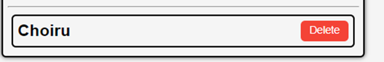 <br/>
Code:<br/>
``` js
<button className='button red' onClick={doDelete}>Delete</button>
```
After: <br/>
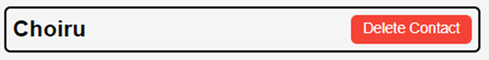
Code:<br/>
```js
<button className='button red' onClick={doDelete}>Delete Contact</button>
```
2) Change the button label in phone component from "Add" to e.g "Add Choiru’s Phone" (3 Marks)<br/>
To do this task , we need to change code in ```NewPhone.js``` in ```components``` folder <br/>
Before:<br/>
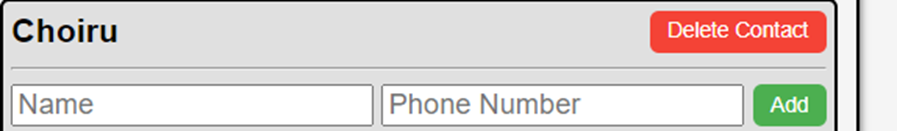
```js
<button className='button green' type='submit'>Add</button>
```
After:<br/>
```js
<button className='button green' type='submit'>Add {contact.name}'s phone</button>
```
3) Change the placeholder text "Name" with input type text into a drop-down menu with 4 categories (3
Marks)<br/>
To do this task , we need to change code in ```NewPhone.js``` in ```components``` folder <br/>
Before: <br/>
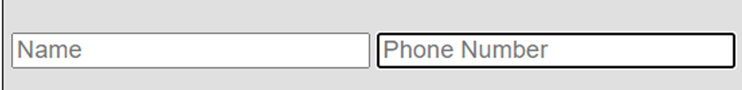
```js
<input type='text' placeholder='Name' onChange={(e) => setName(e.target.value)} value={name}/>
```
After: <br/>
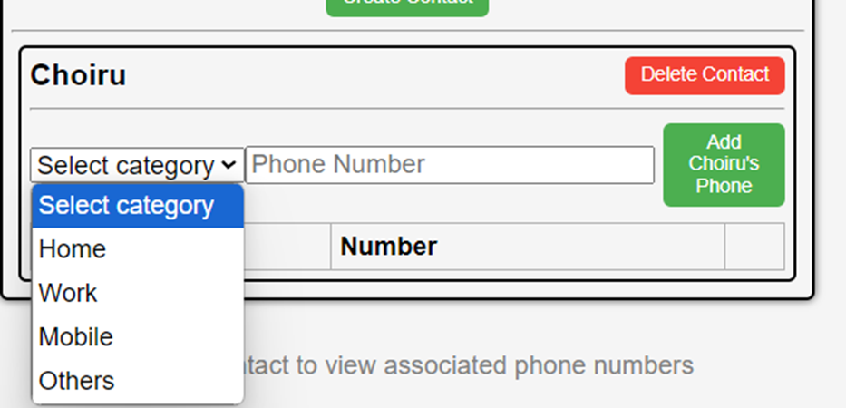
```js
 <select onChange={e => setName(e.target.value)} value={name} >
                <option value="">Select category</option>
                <option value="Home">Home</option>
                <option value="Work">Work</option>
                <option value="Mobile">Mobile</option>
                <option value="Others">Others</option>
            </select>
```
4) In the <tr> element of the table, change the label "Name" to "Phone Type" (2 Marks)<br/>
To do this task, We need to change code in ```Phonelist.js``` in ```components``` folder<br/>
Before:<br/>

```js
<th>Name</th>
```
After: <br/>
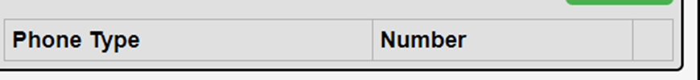
```js
<th>Phone Type</th>
```
</details>
<details>
<summary>Task 2: API COMMAND DEMONSTRATIONS (8 MARKS)</summary>

1) Show the API command for “Show Contact” and provide a screenshot of the output (1 Mark)<br/>
```bash
Get  contact API (GET):
http get http://localhost/api/contacts
HTTP/1.1 200 OK
Access-Control-Allow-Origin: http://localhost:3000
Connection: keep-alive
Content-Length: 203
Content-Type: application/json; charset=utf-8
Date: Tue, 24 Sep 2024 02:20:51 GMT
ETag: W/"cb-Vs6d2BKKVA+jWJLRG7cPTI262CI"
Server: nginx/1.25.1
Vary: Origin
X-Powered-By: Express

[
    {
        "createdAt": "2024-09-24T02:12:44.445Z",
        "id": 1,
        "name": "Huy ",
        "updatedAt": "2024-09-24T02:12:44.445Z"
    },
    {
        "createdAt": "2024-09-24T02:17:32.654Z",
        "id": 2,
        "name": "Khoa",
        "updatedAt": "2024-09-24T02:17:32.654Z"
    }
]
```
2) Show the API command for “Add Contact” and provide a screenshot of the output (1 Mark)<br/>
```bash
Add contact API(POST):
http post http://localhost/api/contacts name="Khoa"
HTTP/1.1 200 OK
Access-Control-Allow-Origin: http://localhost:3000
Connection: keep-alive
Content-Length: 100
Content-Type: application/json; charset=utf-8
Date: Tue, 24 Sep 2024 02:17:32 GMT
ETag: W/"64-VRrKSLehFglbhMKtnSWgls7LYn8"
Server: nginx/1.25.1
Vary: Origin
X-Powered-By: Express

{
    "createdAt": "2024-09-24T02:17:32.654Z",
    "id": 2,
    "name": "Khoa",
    "updatedAt": "2024-09-24T02:17:32.654Z"
}
```
3) Show the API command for “Delete Contact” and provide a screenshot of the output (1 Marks)<br/>
```bash
Delete contact (DELETE)
http delete  http://localhost/api/contacts/2
HTTP/1.1 200 OK
Access-Control-Allow-Origin: http://localhost:3000
Connection: keep-alive
Content-Length: 47
Content-Type: application/json; charset=utf-8
Date: Tue, 24 Sep 2024 02:24:32 GMT
ETag: W/"2f-i0D5Qo4IGfH+OpTTITmyTnSzFvU"
Server: nginx/1.25.1
Vary: Origin
X-Powered-By: Express

{
    "message": "Contact was deleted successfully!"
}
```
4) Show the API command for “Update Contact” and provide a screenshot of the output (1 Marks)<br/>
```bash
Update contact (  PUT)
http put http://localhost/api/contacts/1 name="HuyTrinh"
HTTP/1.1 200 OK
Access-Control-Allow-Origin: http://localhost:3000
Connection: keep-alive
Content-Length: 47
Content-Type: application/json; charset=utf-8
Date: Tue, 24 Sep 2024 02:35:57 GMT
ETag: W/"2f-9DEigpdI8FmatdY6qgJYc7CM5hQ"
Server: nginx/1.25.1
Vary: Origin
X-Powered-By: Express

{
    "message": "Contact was updated successfully."
}
```
5) Show the API command for “Show Phone” and provide a screenshot of the output (1 Mark)<br/>
```bash
Show phone (GET)
http get http://localhost/api/contacts/3/phones
HTTP/1.1 200 OK
Access-Control-Allow-Origin: http://localhost:3000
Connection: keep-alive
Content-Length: 134
Content-Type: application/json; charset=utf-8
Date: Tue, 24 Sep 2024 03:00:21 GMT
ETag: W/"86-gsIiwLVOvUdHylIsbo6XQkIoNUs"
Server: nginx/1.25.1
Vary: Origin
X-Powered-By: Express

[
    {
        "contactId": 3,
        "createdAt": "2024-09-24T02:58:48.330Z",
        "id": 4,
        "name": "Home",
        "number": "011111",
        "updatedAt": "2024-09-24T02:58:48.330Z"
    }
]
```
6) Show the API command for “Add Phone” and provide a screenshot of the output (1 Marks)<br/>
```bash
Add phone (POST)
http post http://localhost/api/contacts/3/phones name="Home" number="011111”
HTTP/1.1 200 OK
Access-Control-Allow-Origin: http://localhost:3000
Connection: keep-alive
Content-Length: 132
Content-Type: application/json; charset=utf-8
Date: Tue, 24 Sep 2024 02:58:48 GMT
ETag: W/"84-CmKdS9bWy7s3IBY8IucRYr414/E"
Server: nginx/1.25.1
Vary: Origin
X-Powered-By: Express

{
    "contactId": 3,
    "createdAt": "2024-09-24T02:58:48.330Z",
    "id": 4,
    "name": "Home",
    "number": "011111",
    "updatedAt": "2024-09-24T02:58:48.330Z"
}
```
7) Show the API command for “Delete Phone” and provide a screenshot of the output (1 Marks)<br/>
```bash
Delete phone (DELETE)
http delete http://localhost/api/contacts/3/phones/4
HTTP/1.1 200 OK
Access-Control-Allow-Origin: http://localhost:3000
Connection: keep-alive
Content-Length: 45
Content-Type: application/json; charset=utf-8
Date: Tue, 24 Sep 2024 03:09:24 GMT
ETag: W/"2d-FdOer7L1Hk5YcQlrlpn01BrNJmA"
Server: nginx/1.25.1
Vary: Origin
X-Powered-By: Express

{
    "message": "Phone was deleted successfully!"
}
```
8) Show the API command for “Update Phone” and provide a screenshot of the output (1 Marks)<br/>
```bash
Update phone (PUT)
http put http://localhost/api/contacts/3/phones/4 name="Work"
HTTP/1.1 200 OK
Access-Control-Allow-Origin: http://localhost:3000
Connection: keep-alive
Content-Length: 45
Content-Type: application/json; charset=utf-8
Date: Tue, 24 Sep 2024 03:07:05 GMT
ETag: W/"2d-p9Lx2PQGimApZ9nkrVa0opZVZlQ"
Server: nginx/1.25.1
Vary: Origin
X-Powered-By: Express

{
    "message": "Phone was updated successfully."
}
``` 
</details>

<details>
<summary>Task 3: - DATABASE MODELLING WITH SEQUELIZE AND TEST THE API COMMANDS WHEN THE DATABASE MODIFICATION DONE (22 MARKS)</summary>

Before doing Task 3 or any tasks further that affects the database, we need to make a small change in ```app.js```<br/>
This line of code will help us to easily make any change that related to the database<br/>
```js
db.sequelize.sync({ force: true }).then(() => {
  console.log("Database synced and updated if necessary.");
});
```
1) Modify the contacts Table (5 Marks):<br/>
``` bash
a. Update the contacts table to include the following attributes:
i. id
ii. Name
iii. Address
```
Code :  Change code  at ```contact.model.js``` file in ```models``` folder. I added address attribute in this table <br/>
```js
module.exports = (sequelize, Sequelize) => {
    const Contact = sequelize.define("contact", {
        id: {
            type: Sequelize.INTEGER,
            autoIncrement: true,
            primaryKey: true,
        },
        name: {
            type: Sequelize.STRING,
        },
        address: {
            type: Sequelize.STRING
        }
    });

    return Contact;
};
```
Result in database:
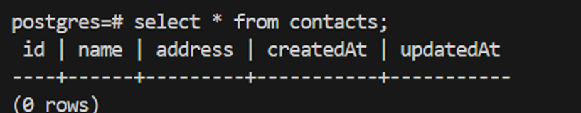
2) Modify the phones Table (5 Marks): <br/>
```bash
a. Update the phones table to include the following attributes:
i. id
ii. phone_type
iii. phone_number
iv. contactId
```
Change code in ```phone.model.js``` file in ```models``` folder to modify the attribute  <br/>
```js
module.exports = (sequelize, Sequelize) => {
    const Phone = sequelize.define("phone", {
        id: {
            type: Sequelize.INTEGER,
            autoIncrement: true,
            primaryKey: true,
        },
        phone_type: {
            type: Sequelize.STRING
        },
        phone_number: {
            type: Sequelize.STRING
        },
        contactId: {
            type: Sequelize.INTEGER,
            references: {
                model: 'contacts',
                key: 'id',
            }
        }
    });
    return Phone;
};
```
Result in database:
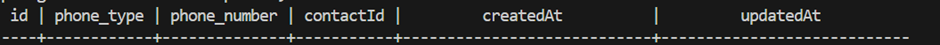

3) Adjust the Front-End (4 Marks):<br/>
To change contact frontend, first we need to change create method in ````contact.controller.js````  file in ```controllers``` folder to help us create a new phone with address attribute <br/>
```js
exports.create = (req, res) => {
    const contact = {
        name: req.body.name,
        address: req.body.address
    };
    Contacts.create(contact)
        .then(data => {
            res.send(data);
        })
        .catch(err => {
            res.status(500).send({
                message:
                    err.message || "Some error occurred"
            });
        });
};
```
After that we change code  in ```Contact.js``` and ```NewContact.js``` in components folder to get the suitable frontend:
```js
   return (
        <div key={contact.id} className='contact' onClick={(e) => setExpanded(!expanded)}>
            <div className='title'>
                <div>
                    <h3>Name: {contact.name}</h3>
                </div>
                <div>
                    <h3>Address: {contact.address}</h3>
                </div>
                <button className='button red' onClick={doDelete}>Delete Contact</button>
            </div>
            <div style={expandStyle}>
                <hr />
                <PhoneList phones={phones} setPhones={setPhones} contact={contact} />
                <CompanyList companies={companies} setCompanies={setCompanies} contact={contact} />
            </div>
        </div>
    );
```

```js
 return (
        <form className='new-contact' onSubmit={createContact}>
            <input type='text' placeholder='Name' onChange={(e) => setName(e.target.value)} value={name} />
            <input
                type='text'
                placeholder='Address'
                onChange={(e) => setAddress(e.target.value)}
                value={address}
            />
            <button className='button green' type='submit'>Create Contact</button>
        </form>
    );
```
Result:
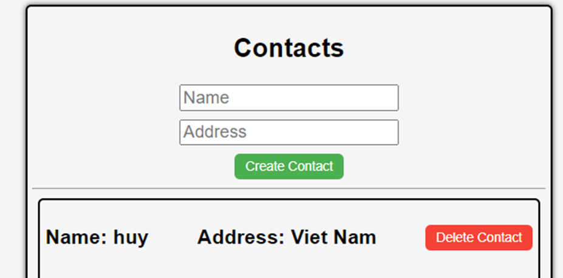
We do the same with Phone<br/>
Change code in create phone method in ```phone.controller.js``` in ```controllers``` folder <br/>
```js
exports.create = (req, res) => {
    const phone = {
        phone_type: req.body.phone_type,
        phone_number: req.body.phone_number,
        contactId: parseInt(req.params.contactId)
    };

    Phones.create(phone)
        .then(data => {
            res.send(data);
        })
        .catch(err => {
            res.status(500).send({
                message:
                    err.message || "Some error occurred"
            });
        });
};
```

Change code at ```Phone.js```, ```PhoneList.js``` and ```NewPhone.js``` component to get the suitable frontend:<br/>
```NewPhone.js``` file: <br/>
Code from :
```js
const [number, setNumber] = useState('');
const [name, setName] = useState('');
```
```js
<select onChange={e => setName(e.target.value)} value={name} >
<input type='text' placeholder='Phone Number' onChange={(e) => setNumber(e.target.value)} value={number} />
```
To:<br/>
```js
const [phone_number, setNumber] = useState('');
const [phone_type, setName] = useState('');
```
```js
<input type='text' placeholder='Phone Number' onChange={(e) => setNumber(e.target.value)} value={phone_number} />
```
```Phone.js``` file : <br/>
```js
<td>{phone.phone_type}</td>
<td>{phone.phone_number}</td>
```
```PhoneList.js```
```js
<th>Phone Type</th>
<th>Phone Number</th>
```
Result:
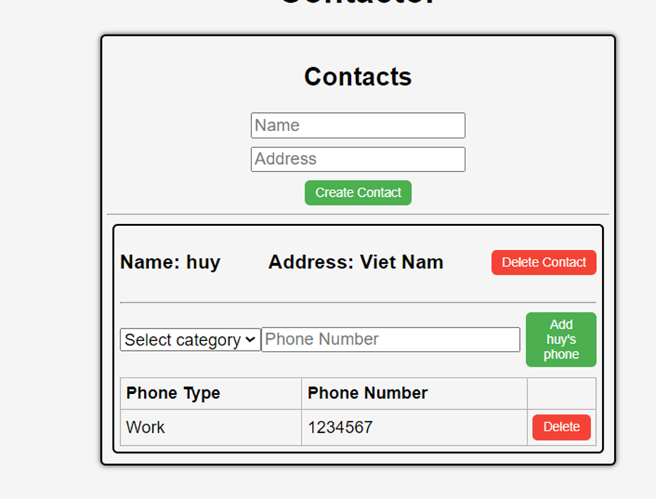
4) Test All APIs related to table modified contacts and phones (8 Marks): <br/>
Contact API <br/>
### Add contact API (POST) 
``` bash
http post http://localhost/api/contacts name="Khoa" address=”Ha Noi”
HTTP/1.1 200 OK
Access-Control-Allow-Origin: http://localhost:3000
Connection: keep-alive
Content-Length: 119
Content-Type: application/json; charset=utf-8
Date: Tue, 24 Sep 2024 11:46:17 GMT
ETag: W/"77-ujajulYXCHdYPgQudiQ35JWsSbY"
Server: nginx/1.25.1
Vary: Origin
X-Powered-By: Express

{
    "address": "Ha Noi",
    "createdAt": "2024-09-24T11:46:17.888Z",
    "id": 3,
    "name": "Khoa",
    "updatedAt": "2024-09-24T11:46:17.888Z"
}

```
### Get contact API (GET)
``` bash
http get http://localhost/api/contacts
HTTP/1.1 200 OK
Access-Control-Allow-Origin: http://localhost:3000
Connection: keep-alive
Content-Length: 242
Content-Type: application/json; charset=utf-8
Date: Tue, 24 Sep 2024 11:47:08 GMT
ETag: W/"f2-yOps9jdrFqdZEQOjTNiEv7RQsKE"
Server: nginx/1.25.1
Vary: Origin
X-Powered-By: Express

[
    {
        "address": "Viet Nam",
        "createdAt": "2024-09-24T07:02:43.679Z",
        "id": 1,
        "name": "huy",
        "updatedAt": "2024-09-24T07:02:43.679Z"
    },
    {
        "address": "Ha Noi",
        "createdAt": "2024-09-24T11:46:17.888Z",
        "id": 3,
        "name": "Khoa",
        "updatedAt": "2024-09-24T11:46:17.888Z"
    }
]
```
### Delete contact (DELETE)
``` bash
http delete  http://localhost/api/contacts/3
HTTP/1.1 200 OK
Access-Control-Allow-Origin: http://localhost:3000
Connection: keep-alive
Content-Length: 47
Content-Type: application/json; charset=utf-8
Date: Tue, 24 Sep 2024 11:47:59 GMT
ETag: W/"2f-i0D5Qo4IGfH+OpTTITmyTnSzFvU"
Server: nginx/1.25.1
Vary: Origin
X-Powered-By: Express

{
    "message": "Contact was deleted successfully!"
}
``` 
### Update contact  (PUT)
``` bash
http put http://localhost/api/contacts/1 name=”Huy Van”  address =”Nam Dinh”
HTTP/1.1 200 OK
Access-Control-Allow-Origin: http://localhost:3000
Connection: keep-alive
Content-Length: 47
Content-Type: application/json; charset=utf-8
Date: Tue, 24 Sep 2024 11:54:06 GMT
ETag: W/"2f-9DEigpdI8FmatdY6qgJYc7CM5hQ"
Server: nginx/1.25.1
Vary: Origin
X-Powered-By: Express

{
    "message": "Contact was updated successfully."
}
```
### Add phone API (POST)
``` bash
http post http://localhost/api/contacts/1/phones phone_type="Home" phone_number=” 01234567”
HTTP/1.1 200 OK
Access-Control-Allow-Origin: http://localhost:3000
Connection: keep-alive
Content-Length: 146
Content-Type: application/json; charset=utf-8
Date: Tue, 24 Sep 2024 11:55:48 GMT
ETag: W/"92-PL7Fk5b/YUOsLjjOiafGHiP97Qo"
Server: nginx/1.25.1
Vary: Origin
X-Powered-By: Express

{
    "contactId": 1,
    "createdAt": "2024-09-24T11:55:48.671Z",
    "id": 2,
    "phone_number": "01234567",
    "phone_type": "Home",
    "updatedAt": "2024-09-24T11:55:48.671Z"
}
```
### Show Phone API (GET)
``` bash
http get http://localhost/api/contacts/1/phones
 HTTP/1.1 200 OK
Access-Control-Allow-Origin: http://localhost:3000
Connection: keep-alive
Content-Length: 294
Content-Type: application/json; charset=utf-8
Date: Tue, 24 Sep 2024 11:58:43 GMT
ETag: W/"126-hy86kFdL2gdWmkk5uWMi22PZroQ"
Server: nginx/1.25.1
Vary: Origin
X-Powered-By: Express

[
    {
        "contactId": 1,
        "createdAt": "2024-09-24T07:02:48.888Z",
        "id": 1,
        "phone_number": "1234567",
        "phone_type": "Work",
        "updatedAt": "2024-09-24T07:02:48.888Z"
    },
    {
        "contactId": 1,
        "createdAt": "2024-09-24T11:55:48.671Z",
        "id": 2,
        "phone_number": "01234567",
        "phone_type": "Home",
        "updatedAt": "2024-09-24T11:55:48.671Z"
    }
]
```
### Update phone (PUT)
``` bash
http put http://localhost/api/contacts/1/phones/2 phone_type="Work" phone_number=” 11111111”
HTTP/1.1 200 OK
Access-Control-Allow-Origin: http://localhost:3000
Connection: keep-alive
Content-Length: 45
Content-Type: application/json; charset=utf-8
Date: Tue, 24 Sep 2024 12:02:24 GMT
ETag: W/"2d-p9Lx2PQGimApZ9nkrVa0opZVZlQ"
Server: nginx/1.25.1
Vary: Origin
X-Powered-By: Express

{
    "message": "Phone was updated successfully."
}
```
### Delete Phone (DELETE)
``` bash
http delete http://localhost/api/contacts/1/phones/2
HTTP/1.1 200 OK
Access-Control-Allow-Origin: http://localhost:3000
Connection: keep-alive
Content-Length: 45
Content-Type: application/json; charset=utf-8
Date: Tue, 24 Sep 2024 12:03:39 GMT
ETag: W/"2d-FdOer7L1Hk5YcQlrlpn01BrNJmA"
Server: nginx/1.25.1
Vary: Origin
X-Powered-By: Express

{
    "message": "Phone was deleted successfully!"
}
```
</details>
<details>
<summary>TASK 4 - EXPANDING THE EXISTING TABLES (E.G. COMPANY) - 30 MARKS</summary>

1) Table creation <br/>
To create a table name "companies" , I will create a file named ```company.model.js``` in ```models``` folder and define all the attribute of this table in this file <br/>
```js
module.exports = (sequelize, Sequelize) => {
    const Company = sequelize.define("company", {
        company_id: {
            type: Sequelize.INTEGER,
            autoIncrement: true,
            primaryKey: true,
        },
        company_name: {
            type: Sequelize.STRING,

        },
        company_address: {
            type: Sequelize.STRING,
        },
        contact_id: {
            type: Sequelize.INTEGER,
            references: {
                model: 'contacts', // Name of the target table (must be 'contacts' in DB)
                key: 'id', // Foreign key referring to contact id
            }
        }
    });

    return Company;
};
```

After saving , this is the result in the database: <br/>
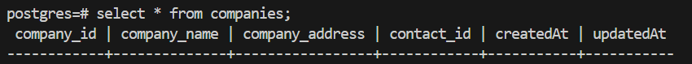
2) API Creation <br/>
So , to creating new API, I defined all routes of company table in a file called ```companies.routes.js``` in ```routes``` folder
```js
module.exports = (app) => {
    const companies = require("../controllers/company.controller.js");
    const router = require("express").Router();

    // Create a company for a contact
    router.post("/contacts/:contactId/companies", companies.create);

    // Get all companies for a contact
    router.get("/contacts/:contactId/companies", companies.findAll);

    // Get a specific company for a contact
    router.get("/contacts/:contactId/companies/:companyId", companies.findOne);

    // Update a specific company for a contact
    router.put("/contacts/:contactId/companies/:companyId", companies.update);

    // Delete a company for a contact
    router.delete("/contacts/:contactId/companies/:companyId", companies.delete);

    // Register the routes under the /api prefix
    app.use('/api', router);
};
```

And to define  method for each route, I make a new file named ```company.controller.js``` in ```controller``` folder
```js
const { where } = require("sequelize");
const db = require("../models");

const companies = db.companies;

const Op = db.Sequelize.Op;

// Create company 

exports.create = (req, res) => {
    // validate request
    const company = {
        company_name: req.body.company_name,
        company_address: req.body.company_address,
        contact_id: parseInt(req.params.contactId)
    };
    //  Save compay in the database

    companies.create(company)
        .then(data => {
            res.send(data);
        })
        .catch(err => {
            res.status(500).send({
                message:
                    err.message || "Some error occurred while creating the Company"
            });
        });
};
// GEt all companies for a contact

exports.findAll = (req, res) => {
    companies.findAll({
        where: {
            contact_id: parseInt(req.params.contactId)
        }
    })
        .then(data => {
            res.send(data);
        })
        .catch(err => {
            res.status(500).send({
                message: err.message || "Some error occured"
            })
        })
}
// Get a specific company for a contact

exports.findOne = (req, res) => {
    companies.findOne({
        where: {
            contact_id: req.params.contactId,
            company_id: req.params.companyId
        }
    })
        .then(data => {
            res.send(data);
        })
        .catch(err => {
            res.status(500).send({
                message: err.message || "Some error occurred with" + req.params.company_id
            })
        })
}
// Update a specific company for a contact

exports.update = async (req, res) => {
    const company_id = req.params.companyId;
    const contact_id = req.params.contactId;

    try {
        // Update the company details in the database
        const [num] = await companies.update(req.body, {
            where: { company_id: company_id, contact_id: contact_id }
        });
        if (num === 1) {
            // Fetch the updated company to return it to the frontend
            const updatedCompany = await companies.findOne({
                where: { company_id: company_id, contact_id: contact_id }
            });

            if (updatedCompany) {
                return res.status(200).json(updatedCompany); // Send the updated company data
            } else {
                return res.status(404).json({ message: "Company not found after update" });
            }
        } else {
            return res.status(400).json({ message: `Cannot update Company with id=${company_id}. Company not found or request body is empty.` });
        }
    } catch (err) {
        return res.status(500).json({ message: "Error updating company with id=" + company_id });
    }
};


//  Delete a company for a contact


exports.delete = (req, res) => {
    const company_id = req.params.companyId;

    companies.destroy({
        where: { company_id: company_id, contact_id: req.params.contactId } // Ensuring deletion by both IDs
    })
        .then(num => {
            if (num == 1) {
                res.send({
                    message: "Company was deleted successfully!"
                });
            } else {
                res.send({
                    message: `Cannot delete Company with id=${company_id}`
                });
            }
        })
        .catch(err => {
            res.status(500).send({
                message: "Could not delete company with id=" + company_id
            });
        });
};

```

And to make all of these things worked, I have to define them in ```app.js``` file :<br/>
```js
require("./routes/contacts.routes")(app);
require("./routes/phones.routes")(app);
require("./routes/companies.routes")(app);
require("./routes/stats.routes")(app);
```
And now this is API test result: <br/>
### ADD COMPANY API (POST)
```bash
http post http://localhost/api/contacts/1/companies company_name="VietTel" company_address="HaNoi"
HTTP/1.1 200 OK
Access-Control-Allow-Origin: http://localhost:3000
Connection: keep-alive
Content-Length: 160
Content-Type: application/json; charset=utf-8
Date: Sun, 06 Oct 2024 21:35:33 GMT
ETag: W/"a0-bn5wp9L2U5oRAjK7yn8Kd0XxTd4"
Server: nginx/1.25.1
Vary: Origin
X-Powered-By: Express

{
    "company_address": "HaNoi",
    "company_id": 1,
    "company_name": "VietTel",
    "contact_id": 1,
    "createdAt": "2024-10-06T21:35:32.980Z",
    "updatedAt": "2024-10-06T21:35:32.980Z"
}
```
### SHOW COMPANY API (GET)
```bash
http get http://localhost/api/contacts/1/companies
HTTP/1.1 200 OK
Access-Control-Allow-Origin: http://localhost:3000
Connection: keep-alive
Content-Length: 162
Content-Type: application/json; charset=utf-8
Date: Sun, 06 Oct 2024 21:37:32 GMT
ETag: W/"a2-Bs7jeohLrNjjvKHlCOo4PsNb45g"
Server: nginx/1.25.1
Vary: Origin
X-Powered-By: Express

[
    {
        "company_address": "HaNoi",
        "company_id": 1,
        "company_name": "VietTel",
        "contact_id": 1,
        "createdAt": "2024-10-06T21:35:32.980Z",
        "updatedAt": "2024-10-06T21:35:32.980Z"
    }
]
```
### UPDATE COMPANY (PUT)
```bash
http put http://localhost/api/contacts/1/companies/1 company_name="Amazon" company_address="Melbourne"
HTTP/1.1 200 OK
Access-Control-Allow-Origin: http://localhost:3000
Connection: keep-alive
Content-Length: 163
Content-Type: application/json; charset=utf-8
Date: Sun, 06 Oct 2024 21:41:07 GMT
ETag: W/"a3-rfOPA2VY5tWyggO5nztmZWRngTs"
Server: nginx/1.25.1
Vary: Origin
X-Powered-By: Express

{
    "company_address": "Melbourne",
    "company_id": 1,
    "company_name": "Amazon",
    "contact_id": 1,
    "createdAt": "2024-10-06T21:35:32.980Z",
    "updatedAt": "2024-10-06T21:41:07.538Z"
}
```
### DELETE COMPANY (DELETE)
```bash
http delete http://localhost/api/contacts/1/companies/1
HTTP/1.1 200 OK
Access-Control-Allow-Origin: http://localhost:3000
Connection: keep-alive
Content-Length: 47
Content-Type: application/json; charset=utf-8
Date: Sun, 06 Oct 2024 21:44:41 GMT
ETag: W/"2f-goeWLYgQgcZh1o2QS0V4ovFdEa0"
Server: nginx/1.25.1
Vary: Origin
X-Powered-By: Express

{
    "message": "Company was deleted successfully!"
}
```

</details>
<details>
<summary>TASK 5 - FRONT END (30 MARKS)</summary>

So in this task, I will create 3 new file in the ```components``` folder. They are ```Company.js``` ,```NewCompany.js```, ```CompanyList.js```<br/>
Here’s a short summary of the functionality of the three files:<br/>
```Company.js```: Manages individual company data, allowing for editing and deleting companies. It handles form updates and communicates with the backend to persist changes like company name or address. <br/>

```NewCompany.js```: Provides the form and logic for creating new companies. It allows users to enter new company details, which are then sent to the backend to add a new company to the database.<br/>

```CompanyList.js```: Displays a list of all companies associated with a contact. It fetches the company data from the backend and renders each company component, allowing for interactions like editing or deleting companies.<br/>

And here is code of each file:<br/>
```Company.js``` file:
```js
import { useState } from "react";

function Company(props) {
    const { contact, company, companies, setCompanies } = props;
    const [isEditing, setIsEditing] = useState(false);
    const [editedName, setEditedName] = useState(company.company_name);
    const [editedAddress, setEditedAddress] = useState(company.company_address);

    // Update Company Function
    async function updateCompany(e) {
        e.preventDefault();

        try {
            const response = await fetch(`http://localhost/api/contacts/${contact.id}/companies/${company.company_id}`, {
                method: 'PUT',
                headers: {
                    'Content-Type': 'application/json',
                },
                body: JSON.stringify({
                    company_name: editedName,
                    company_address: editedAddress,
                }),
            });

            if (!response.ok) {
                throw new Error(`Failed to update company: ${response.status} ${response.statusText}`);
            }

            const updatedCompany = await response.json();

            if (!updatedCompany || !updatedCompany.company_id) {
                throw new Error('Invalid data received from server');
            }

            // Update the company in the state
            const updatedCompanies = companies.map((c) =>
                c.company_id === updatedCompany.company_id ? updatedCompany : c
            );
            setCompanies(updatedCompanies);
            setIsEditing(false);  // Exit editing mode

        } catch (error) {
            console.error('Error updating company:', error);
            alert(`An error occurred while updating the company: ${error.message}`);
        }
    }

    // Delete Company Function
    async function deleteCompany() {
        const response = await fetch(`http://localhost/api/contacts/${contact.id}/companies/${company.company_id}`, {
            method: 'DELETE'
        });
        if (response.ok) {
            let newCompanies = companies.filter((c) => c.company_id !== company.company_id);
            setCompanies(newCompanies);
        } else {
            console.error('Error deleting company');
        }
    }

    return (
        <tr>
            {isEditing ? (
                <>
                    <td>
                        <input
                            type="text"
                            value={editedName}
                            onChange={(e) => setEditedName(e.target.value)}
                        />
                    </td>
                    <td>
                        <input
                            type="text"
                            value={editedAddress}
                            onChange={(e) => setEditedAddress(e.target.value)}
                        />
                    </td>
                    <td>
                        <button className="button green" onClick={updateCompany}>Save</button>
                        <button className="button red" onClick={() => setIsEditing(false)}>Cancel</button>
                    </td>
                </>
            ) : (
                <>
                    <td>{company.company_name}</td>
                    <td>{company.company_address}</td>
                    <td>
                        <button className="button green" onClick={() => setIsEditing(true)}>Edit</button>
                        <button className="button red" onClick={deleteCompany}>Delete</button>
                    </td>
                </>
            )}
        </tr>
    );
}

export default Company;

```
```NewCompany.js``` file:
```js
import { useState } from "react";

function NewCompany(props) {
    const { contact, companies, setCompanies } = props;
    const [company_name, setName] = useState('');
    const [company_address, setAddress] = useState('');
    async function createCompany(e) {
        e.preventDefault();
        const response = await fetch('http://localhost/api/contacts/' + contact.id + '/companies', {
            method: 'POST',
            headers: {
                'Content-Type': 'application/json'
            },
            body: JSON.stringify({
                company_name,
                company_address
            })
        });
        const data = await response.json();
        if (data.company_id) {
            setCompanies([...companies, data]);
        }
        setName('');
        setAddress('');
    }
    return (
        <form onSubmit={createCompany} onClick={(e) => e.stopPropagation()} className="new-company" >
            <input type="text" placeholder="Company Name" onChange={(e) => setName(e.target.value)} value={company_name} />
            <input type="text" placeholder="Company Address" onChange={(e) => setAddress(e.target.value)} value={company_address} />
            <button className='button green' type='submit'>Add {contact.name}'s company</button>
        </form>
    );
}
export default NewCompany;
```
```CompanyList.js``` file:
```js 
import { useState, useEffect } from "react";
import NewCompany from "./NewCompany.js"
import Company from "./Company.js";

function CompanyList(props) {
    const { contact, companies, setCompanies } = props;
    useEffect(() => {
        // Fetch companies for the contact when the component mounts
        fetch(`http://localhost/api/contacts/${contact.id}/companies`)
            .then(response => response.json())
            .then(data => setCompanies(data))
            .catch((error) => {
                console.error('Error:', error);
            });
    }, [contact.id, setCompanies]);

    return (
        <div className="phone-list">
            <h2>Companies for {contact.name}</h2>
            <NewCompany contact={contact} companies={companies} setCompanies={setCompanies} />
            <table onClick={(e) => e.stopPropagation()}>
                <thead>
                    <tr>
                        <th>Company Name</th>
                        <th>Company Address</th>
                        <th>Modification</th>
                    </tr>
                </thead>
                <tbody>
                    {
                        companies.map((company) => {
                            return (
                                <Company key={company.company_id} company={company} companies={companies} setCompanies={setCompanies} contact={contact} />
                            );
                        })
                    }
                </tbody>
            </table>
        </div>
    );
}
export default CompanyList;
```
And this is the result:<br/>
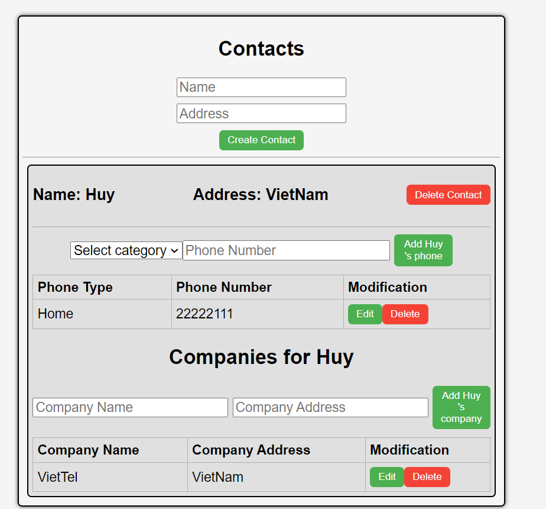
</details>

<details>
<summary>BONUS IN  PHONE API</summary>

I added edit function in Phone. And to do this, I have to repair the UPDATE method in ```phone.controllers.js``` a little bit.<br/>
```js
// Update one phone by id
exports.update = async (req, res) => {
    const phoneId = req.params.phoneId;
    const contactId = req.params.contactId;

    try {
        // Update the phone details in the database
        const [num] = await Phones.update(req.body, {
            where: { id: phoneId, contactId: contactId }
        });

        if (num === 1) {
            // Fetch the updated phone to return it to the frontend
            const updatedPhone = await Phones.findOne({
                where: { id: phoneId, contactId: contactId }
            });

            if (updatedPhone) {
                return res.status(200).json(updatedPhone); // Send the updated phone data
            } else {
                return res.status(404).json({ message: "Phone not found after update" });
            }
        } else {
            return res.status(400).json({ message: `Cannot update Phone with id=${phoneId}. Phone not found or request body is empty.` });
        }
    } catch (err) {
        return res.status(500).json({ message: "Error updating phone with id=" + phoneId });
    }
};
```
And change the code in ```Phone.js``` in ```components``` folder :
```js
import { useState } from "react";

function Phone(props) {
    const { contact, phone, phones, setPhones } = props;
    const [isEditing, setIsEditing] = useState(false);
    const [editedType, setEditedType] = useState(phone.phone_type);
    const [editedNumber, setEditedNumber] = useState(phone.phone_number);

    // Update Phone Function
    async function updatePhone(e) {
        e.preventDefault();

        try {
            const response = await fetch(`http://localhost/api/contacts/${contact.id}/phones/${phone.id}`, {
                method: 'PUT',
                headers: {
                    'Content-Type': 'application/json',
                },
                body: JSON.stringify({
                    phone_type: editedType,
                    phone_number: editedNumber,
                }),
            });

            if (!response.ok) {
                throw new Error(`Failed to update phone: ${response.status} ${response.statusText}`);
            }

            const updatedPhone = await response.json();

            if (!updatedPhone || !updatedPhone.id) {
                throw new Error('Invalid data received from server');
            }

            // Update the phone in the state
            const updatedPhones = phones.map((p) =>
                p.id === updatedPhone.id ? updatedPhone : p
            );
            setPhones(updatedPhones);
            setIsEditing(false); // Exit editing mode

        } catch (error) {
            console.error('Error updating phone:', error);
            alert(`An error occurred while updating the phone: ${error.message}`);
        }
    }

    // Delete Phone Function
    async function deletePhone() {
        const response = await fetch(`http://localhost/api/contacts/${contact.id}/phones/${phone.id}`, {
            method: 'DELETE',
        });

        if (response.ok) {
            let newPhones = phones.filter((p) => p.id !== phone.id);
            setPhones(newPhones);
        } else {
            console.error('Error deleting phone');
        }
    }

    return (
        <tr>
            {isEditing ? (
                <>
                    <td>
                        <input
                            type="text"
                            value={editedType}
                            onChange={(e) => setEditedType(e.target.value)}
                        />
                    </td>
                    <td>
                        <input
                            type="text"
                            value={editedNumber}
                            onChange={(e) => setEditedNumber(e.target.value)}
                        />
                    </td>
                    <td>
                        <button className="button green" onClick={updatePhone}>Save</button>
                        <button className="button red" onClick={() => setIsEditing(false)}>Cancel</button>
                    </td>
                </>
            ) : (
                <>
                    <td>{phone.phone_type}</td>
                    <td>{phone.phone_number}</td>
                    <td>
                        <button className="button green" onClick={() => setIsEditing(true)}>Edit</button>
                        <button className="button red" onClick={deletePhone}>Delete</button>
                    </td>
                </>
            )}
        </tr>
    );
}

export default Phone;

```
And this is the result:<br/>
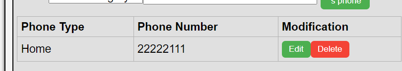
</details>