# README.md


Van Huy Trinh's shared repository: https://github.com/huyTrinhVAn/AA2-VanHuyTrinh-22116467


### Phone API
<details>
<summary>Task 1</summary>
1. Change the button label from contact component from "Delete" to "Delete Contact" <br/>
Change at ```contact.js``` in  ```components``` folder <br/>

Origin:<br/>
 <br/>
Code:<br/>
``` js
<button className='button red' onClick={doDelete}>Delete</button>
```
After: <br/>

Code:<br/>
```js
<button className='button red' onClick={doDelete}>Delete Contact</button>
```
2) Change the button label in phone component from "Add" to e.g "Add Choiru’s Phone" (3 Marks)<br/>
To do this task , we need to change code in ```NewPhone.js``` in ```components``` folder <br/>
Before:<br/>

```js
<button className='button green' type='submit'>Add</button>
```
After:<br/>
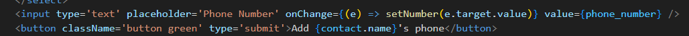
```js
<button className='button green' type='submit'>Add {contact.name}'s phone</button>
```
3) Change the placeholder text "Name" with input type text into a drop-down menu with 4 categories (3
Marks)<br/>
To do this task , we need to change code in ```NewPhone.js``` in ```components``` folder <br/>
Before: <br/>

```js
<input type='text' placeholder='Name' onChange={(e) => setName(e.target.value)} value={name}/>
```
After: <br/>

```js
 <select onChange={e => setName(e.target.value)} value={name} >
                <option value="">Select category</option>
                <option value="Home">Home</option>
                <option value="Work">Work</option>
                <option value="Mobile">Mobile</option>
                <option value="Others">Others</option>
            </select>
```
4) In the <tr> element of the table, change the label "Name" to "Phone Type" (2 Marks)<br/>
To do this task, We need to change code in ```Phonelist.js``` in ```components``` folder<br/>
Before:<br/>

```js
<th>Name</th>
```
After: <br/>

```js
<th>Phone Type</th>
```
</details>
<details>
<summary>Task 2: API COMMAND DEMONSTRATIONS (8 MARKS)</summary>
Task 2: API COMMAND DEMONSTRATIONS (8 MARKS)<br/>

1) Show the API command for “Show Contact” and provide a screenshot of the output (1 Mark)<br/>
```bash
Get  contact API (GET):
http get http://localhost/api/contacts
HTTP/1.1 200 OK
Access-Control-Allow-Origin: http://localhost:3000
Connection: keep-alive
Content-Length: 203
Content-Type: application/json; charset=utf-8
Date: Tue, 24 Sep 2024 02:20:51 GMT
ETag: W/"cb-Vs6d2BKKVA+jWJLRG7cPTI262CI"
Server: nginx/1.25.1
Vary: Origin
X-Powered-By: Express

[
    {
        "createdAt": "2024-09-24T02:12:44.445Z",
        "id": 1,
        "name": "Huy ",
        "updatedAt": "2024-09-24T02:12:44.445Z"
    },
    {
        "createdAt": "2024-09-24T02:17:32.654Z",
        "id": 2,
        "name": "Khoa",
        "updatedAt": "2024-09-24T02:17:32.654Z"
    }
]
```
2) Show the API command for “Add Contact” and provide a screenshot of the output (1 Mark)<br/>
```bash
Add contact API(POST):
http post http://localhost/api/contacts name="Khoa"
HTTP/1.1 200 OK
Access-Control-Allow-Origin: http://localhost:3000
Connection: keep-alive
Content-Length: 100
Content-Type: application/json; charset=utf-8
Date: Tue, 24 Sep 2024 02:17:32 GMT
ETag: W/"64-VRrKSLehFglbhMKtnSWgls7LYn8"
Server: nginx/1.25.1
Vary: Origin
X-Powered-By: Express

{
    "createdAt": "2024-09-24T02:17:32.654Z",
    "id": 2,
    "name": "Khoa",
    "updatedAt": "2024-09-24T02:17:32.654Z"
}
```
3) Show the API command for “Delete Contact” and provide a screenshot of the output (1 Marks)<br/>
```bash
Delete contact (DELETE)
http delete  http://localhost/api/contacts/2
HTTP/1.1 200 OK
Access-Control-Allow-Origin: http://localhost:3000
Connection: keep-alive
Content-Length: 47
Content-Type: application/json; charset=utf-8
Date: Tue, 24 Sep 2024 02:24:32 GMT
ETag: W/"2f-i0D5Qo4IGfH+OpTTITmyTnSzFvU"
Server: nginx/1.25.1
Vary: Origin
X-Powered-By: Express

{
    "message": "Contact was deleted successfully!"
}
```
4) Show the API command for “Update Contact” and provide a screenshot of the output (1 Marks)<br/>
```bash
Update contact (  PUT)
http put http://localhost/api/contacts/1 name="HuyTrinh"
HTTP/1.1 200 OK
Access-Control-Allow-Origin: http://localhost:3000
Connection: keep-alive
Content-Length: 47
Content-Type: application/json; charset=utf-8
Date: Tue, 24 Sep 2024 02:35:57 GMT
ETag: W/"2f-9DEigpdI8FmatdY6qgJYc7CM5hQ"
Server: nginx/1.25.1
Vary: Origin
X-Powered-By: Express

{
    "message": "Contact was updated successfully."
}
```
5) Show the API command for “Show Phone” and provide a screenshot of the output (1 Mark)<br/>
```bash
Show phone (GET)
http get http://localhost/api/contacts/3/phones
HTTP/1.1 200 OK
Access-Control-Allow-Origin: http://localhost:3000
Connection: keep-alive
Content-Length: 134
Content-Type: application/json; charset=utf-8
Date: Tue, 24 Sep 2024 03:00:21 GMT
ETag: W/"86-gsIiwLVOvUdHylIsbo6XQkIoNUs"
Server: nginx/1.25.1
Vary: Origin
X-Powered-By: Express

[
    {
        "contactId": 3,
        "createdAt": "2024-09-24T02:58:48.330Z",
        "id": 4,
        "name": "Home",
        "number": "011111",
        "updatedAt": "2024-09-24T02:58:48.330Z"
    }
]
```
6) Show the API command for “Add Phone” and provide a screenshot of the output (1 Marks)<br/>
```bash
Add phone (POST)
http post http://localhost/api/contacts/3/phones name="Home" number="011111”
HTTP/1.1 200 OK
Access-Control-Allow-Origin: http://localhost:3000
Connection: keep-alive
Content-Length: 132
Content-Type: application/json; charset=utf-8
Date: Tue, 24 Sep 2024 02:58:48 GMT
ETag: W/"84-CmKdS9bWy7s3IBY8IucRYr414/E"
Server: nginx/1.25.1
Vary: Origin
X-Powered-By: Express

{
    "contactId": 3,
    "createdAt": "2024-09-24T02:58:48.330Z",
    "id": 4,
    "name": "Home",
    "number": "011111",
    "updatedAt": "2024-09-24T02:58:48.330Z"
}
```
7) Show the API command for “Delete Phone” and provide a screenshot of the output (1 Marks)<br/>
```bash
Delete phone (DELETE)
http delete http://localhost/api/contacts/3/phones/4
HTTP/1.1 200 OK
Access-Control-Allow-Origin: http://localhost:3000
Connection: keep-alive
Content-Length: 45
Content-Type: application/json; charset=utf-8
Date: Tue, 24 Sep 2024 03:09:24 GMT
ETag: W/"2d-FdOer7L1Hk5YcQlrlpn01BrNJmA"
Server: nginx/1.25.1
Vary: Origin
X-Powered-By: Express

{
    "message": "Phone was deleted successfully!"
}
```
8) Show the API command for “Update Phone” and provide a screenshot of the output (1 Marks)<br/>
```bash
Update phone (PUT)
http put http://localhost/api/contacts/3/phones/4 name="Work"
HTTP/1.1 200 OK
Access-Control-Allow-Origin: http://localhost:3000
Connection: keep-alive
Content-Length: 45
Content-Type: application/json; charset=utf-8
Date: Tue, 24 Sep 2024 03:07:05 GMT
ETag: W/"2d-p9Lx2PQGimApZ9nkrVa0opZVZlQ"
Server: nginx/1.25.1
Vary: Origin
X-Powered-By: Express

{
    "message": "Phone was updated successfully."
}
``` 
</details>

Task 3: - DATABASE MODELLING WITH SEQUELIZE AND TEST THE API COMMANDS WHEN THE
DATABASE MODIFICATION DONE (22 MARKS)<br/>
Before doing Task 3 or any tasks further that affects the database, we need to make a small change in ```app.js```<br/>
This line of code will help us to easily make any change that related to the database<br/>
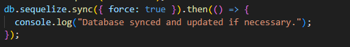 <br/>
1) Modify the contacts Table (5 Marks):<br/>
``` bash
a. Update the contacts table to include the following attributes:
i. id
ii. Name
iii. Address
```
Code :  Change at ```contact.model.js``` file in ```models``` folder:
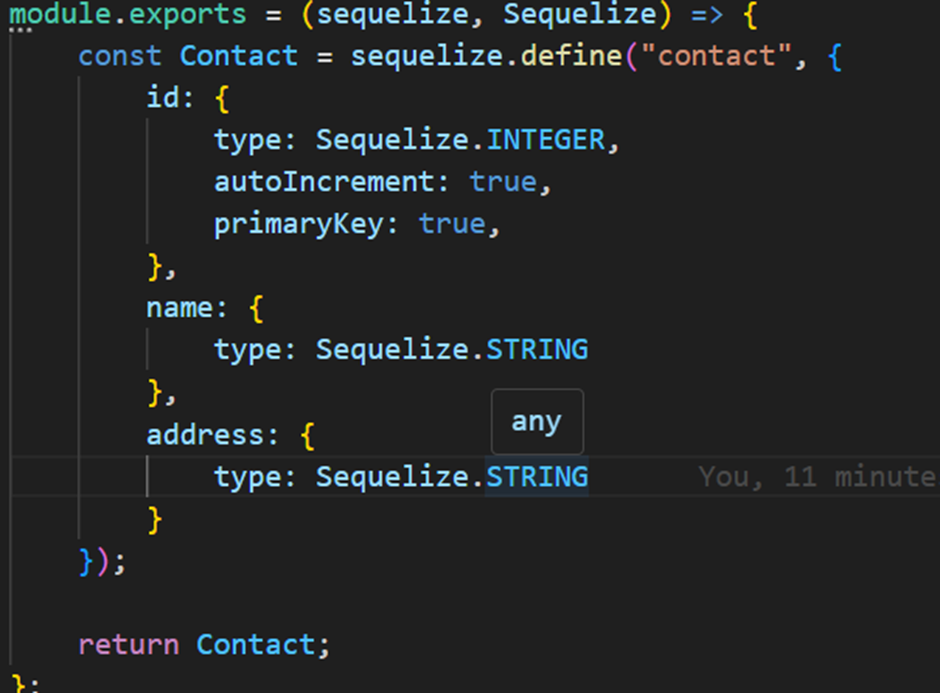
Result in database:

2) Modify the phones Table (5 Marks): <br/>
```bash
a. Update the phones table to include the following attributes:
i. id
ii. phone_type
iii. phone_number
iv. contactId
```
Change code in ```phone.model.js``` file in ```models``` folder to modify the attribute  <br/>
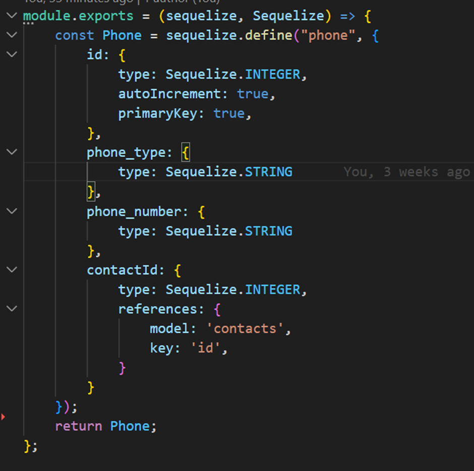
Result in database:


3) Adjust the Front-End (4 Marks):<br/>
To change contact frontend, first we need to change create method in ````contact.controller.js````  file in ```controllers``` folder to help us create a new phone with address attribute <br/>
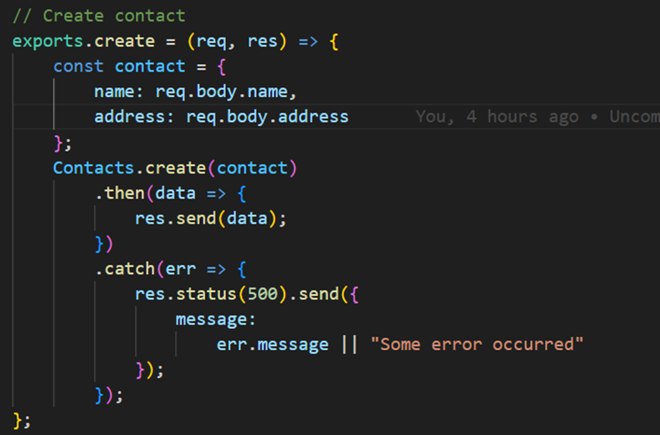
After that we change code  in ```Contact.js``` and ```NewContact.js``` in components folder to get the suitable frontend:
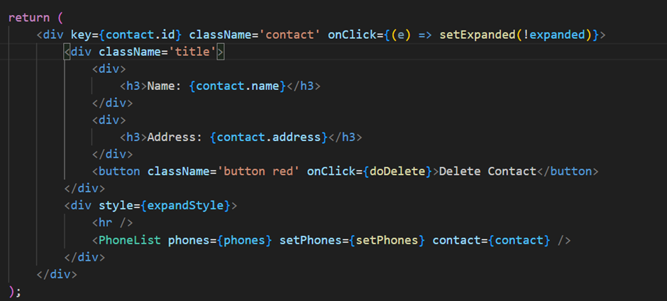
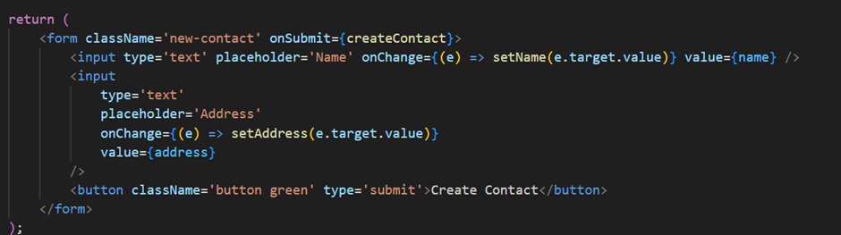
Result:

We do the same with Phone<br/>
Change code in create phone method in ```phone.controller.js``` in controllers folder <br/>
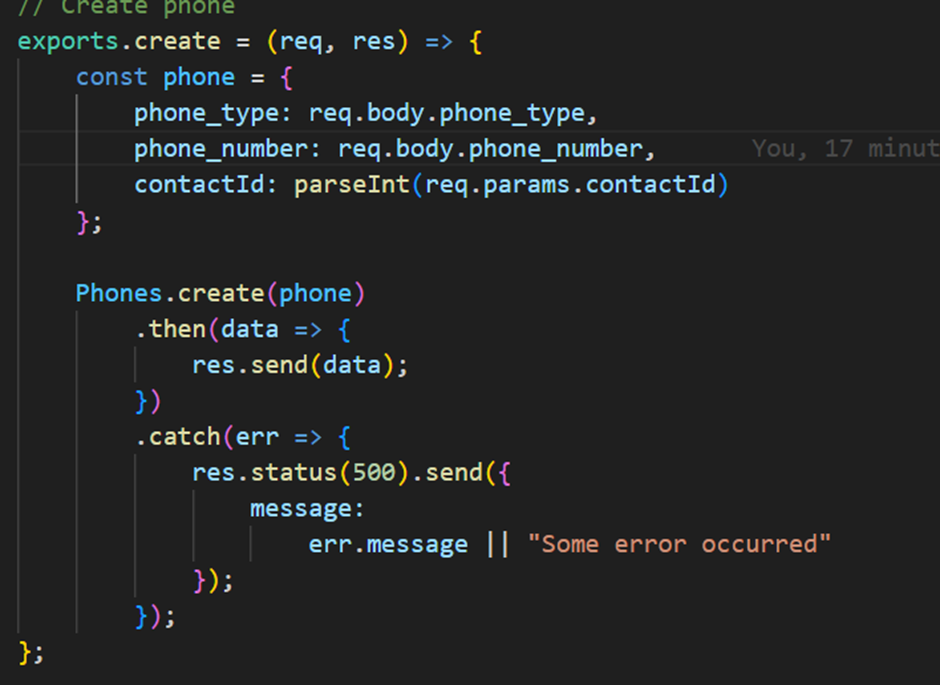
Change at ```Phone.js```, ```PhoneList.js``` and ```NewPhone.js``` component to get the suitable frontend:
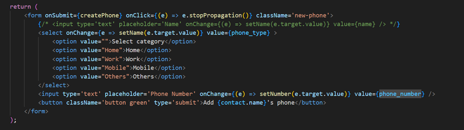
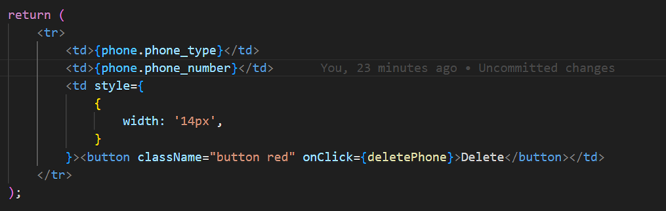
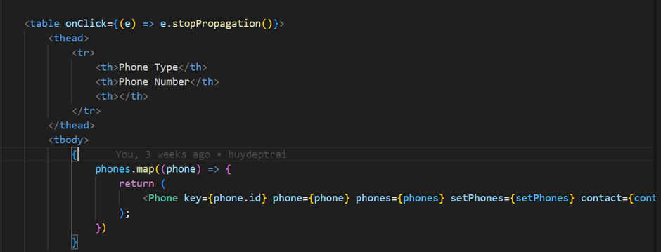
Result:

4) Test All APIs related to table modified contacts and phones (8 Marks): <br/>
Contact API <br/>
### Add contact API (POST) 
``` bash
http post http://localhost/api/contacts name="Khoa" address=”Ha Noi”
HTTP/1.1 200 OK
Access-Control-Allow-Origin: http://localhost:3000
Connection: keep-alive
Content-Length: 119
Content-Type: application/json; charset=utf-8
Date: Tue, 24 Sep 2024 11:46:17 GMT
ETag: W/"77-ujajulYXCHdYPgQudiQ35JWsSbY"
Server: nginx/1.25.1
Vary: Origin
X-Powered-By: Express

{
    "address": "Ha Noi",
    "createdAt": "2024-09-24T11:46:17.888Z",
    "id": 3,
    "name": "Khoa",
    "updatedAt": "2024-09-24T11:46:17.888Z"
}

```
### Get contact API (GET)
``` bash
http get http://localhost/api/contacts
HTTP/1.1 200 OK
Access-Control-Allow-Origin: http://localhost:3000
Connection: keep-alive
Content-Length: 242
Content-Type: application/json; charset=utf-8
Date: Tue, 24 Sep 2024 11:47:08 GMT
ETag: W/"f2-yOps9jdrFqdZEQOjTNiEv7RQsKE"
Server: nginx/1.25.1
Vary: Origin
X-Powered-By: Express

[
    {
        "address": "Viet Nam",
        "createdAt": "2024-09-24T07:02:43.679Z",
        "id": 1,
        "name": "huy",
        "updatedAt": "2024-09-24T07:02:43.679Z"
    },
    {
        "address": "Ha Noi",
        "createdAt": "2024-09-24T11:46:17.888Z",
        "id": 3,
        "name": "Khoa",
        "updatedAt": "2024-09-24T11:46:17.888Z"
    }
]
```
### Delete contact (DELETE)
``` bash
http delete  http://localhost/api/contacts/3
HTTP/1.1 200 OK
Access-Control-Allow-Origin: http://localhost:3000
Connection: keep-alive
Content-Length: 47
Content-Type: application/json; charset=utf-8
Date: Tue, 24 Sep 2024 11:47:59 GMT
ETag: W/"2f-i0D5Qo4IGfH+OpTTITmyTnSzFvU"
Server: nginx/1.25.1
Vary: Origin
X-Powered-By: Express

{
    "message": "Contact was deleted successfully!"
}
``` 
### Update contact  (PUT)
``` bash
http put http://localhost/api/contacts/1 name=”Huy Van”  address =”Nam Dinh”
HTTP/1.1 200 OK
Access-Control-Allow-Origin: http://localhost:3000
Connection: keep-alive
Content-Length: 47
Content-Type: application/json; charset=utf-8
Date: Tue, 24 Sep 2024 11:54:06 GMT
ETag: W/"2f-9DEigpdI8FmatdY6qgJYc7CM5hQ"
Server: nginx/1.25.1
Vary: Origin
X-Powered-By: Express

{
    "message": "Contact was updated successfully."
}
```
### Add phone API (POST)
``` bash
http post http://localhost/api/contacts/1/phones phone_type="Home" phone_number=” 01234567”
HTTP/1.1 200 OK
Access-Control-Allow-Origin: http://localhost:3000
Connection: keep-alive
Content-Length: 146
Content-Type: application/json; charset=utf-8
Date: Tue, 24 Sep 2024 11:55:48 GMT
ETag: W/"92-PL7Fk5b/YUOsLjjOiafGHiP97Qo"
Server: nginx/1.25.1
Vary: Origin
X-Powered-By: Express

{
    "contactId": 1,
    "createdAt": "2024-09-24T11:55:48.671Z",
    "id": 2,
    "phone_number": "01234567",
    "phone_type": "Home",
    "updatedAt": "2024-09-24T11:55:48.671Z"
}
```
### Show Phone API (GET)
``` bash
http get http://localhost/api/contacts/1/phones
 HTTP/1.1 200 OK
Access-Control-Allow-Origin: http://localhost:3000
Connection: keep-alive
Content-Length: 294
Content-Type: application/json; charset=utf-8
Date: Tue, 24 Sep 2024 11:58:43 GMT
ETag: W/"126-hy86kFdL2gdWmkk5uWMi22PZroQ"
Server: nginx/1.25.1
Vary: Origin
X-Powered-By: Express

[
    {
        "contactId": 1,
        "createdAt": "2024-09-24T07:02:48.888Z",
        "id": 1,
        "phone_number": "1234567",
        "phone_type": "Work",
        "updatedAt": "2024-09-24T07:02:48.888Z"
    },
    {
        "contactId": 1,
        "createdAt": "2024-09-24T11:55:48.671Z",
        "id": 2,
        "phone_number": "01234567",
        "phone_type": "Home",
        "updatedAt": "2024-09-24T11:55:48.671Z"
    }
]
```
### Update phone (PUT)
``` bash
http put http://localhost/api/contacts/1/phones/2 phone_type="Work" phone_number=” 11111111”
HTTP/1.1 200 OK
Access-Control-Allow-Origin: http://localhost:3000
Connection: keep-alive
Content-Length: 45
Content-Type: application/json; charset=utf-8
Date: Tue, 24 Sep 2024 12:02:24 GMT
ETag: W/"2d-p9Lx2PQGimApZ9nkrVa0opZVZlQ"
Server: nginx/1.25.1
Vary: Origin
X-Powered-By: Express

{
    "message": "Phone was updated successfully."
}
```
### Delete Phone (DELETE)
``` bash
http delete http://localhost/api/contacts/1/phones/2
HTTP/1.1 200 OK
Access-Control-Allow-Origin: http://localhost:3000
Connection: keep-alive
Content-Length: 45
Content-Type: application/json; charset=utf-8
Date: Tue, 24 Sep 2024 12:03:39 GMT
ETag: W/"2d-FdOer7L1Hk5YcQlrlpn01BrNJmA"
Server: nginx/1.25.1
Vary: Origin
X-Powered-By: Express

{
    "message": "Phone was deleted successfully!"
}
```

TASK 4 - EXPANDING THE EXISTING TABLES (E.G. COMPANY) - 30 MARKS
1) Table creation  
To create a table name "companies" , I will create a file named "company.model.js" in ```models``` folder and define all the attribute of this table in this file <br/>
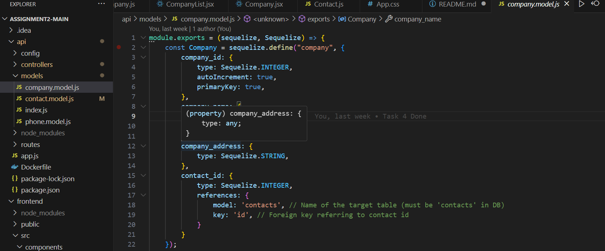
After saving , this is the result in the database: <br/>

2) API Creation
So , to creating new API, I defined routes in a file called "companies.routes.js" in routes folder
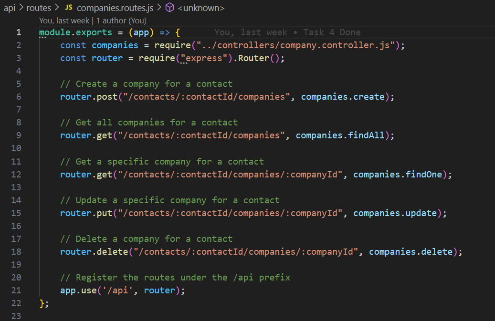
And to define method in each route, I make a new file named company.controller.js in controller folder
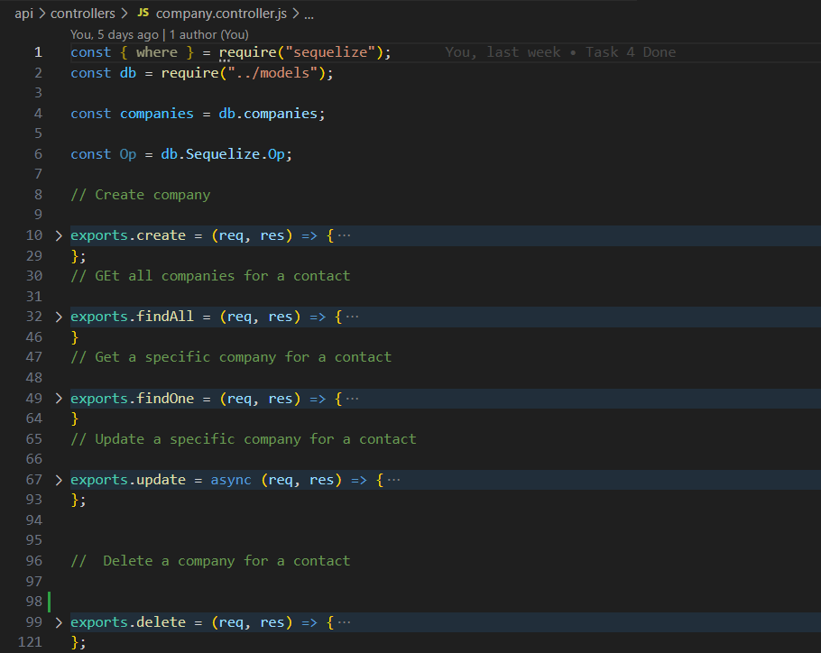
And to make all of these things worked, I have to define them in app,js file 
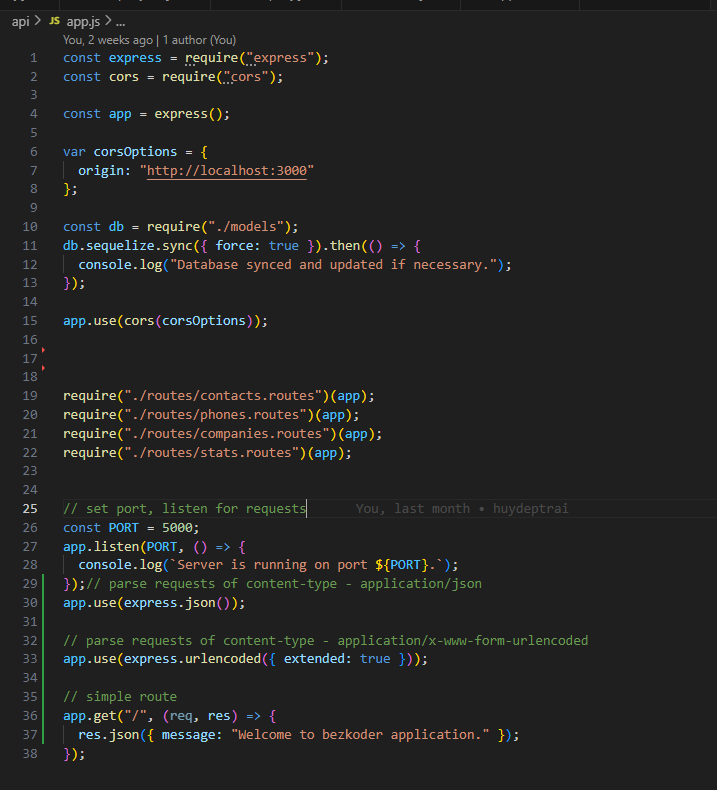
And now this is API test result:
### ADD COMPANY API (POST)
```bash
http post http://localhost/api/contacts/1/companies company_name="VietTel" company_address="HaNoi"
HTTP/1.1 200 OK
Access-Control-Allow-Origin: http://localhost:3000
Connection: keep-alive
Content-Length: 160
Content-Type: application/json; charset=utf-8
Date: Sun, 06 Oct 2024 21:35:33 GMT
ETag: W/"a0-bn5wp9L2U5oRAjK7yn8Kd0XxTd4"
Server: nginx/1.25.1
Vary: Origin
X-Powered-By: Express

{
    "company_address": "HaNoi",
    "company_id": 1,
    "company_name": "VietTel",
    "contact_id": 1,
    "createdAt": "2024-10-06T21:35:32.980Z",
    "updatedAt": "2024-10-06T21:35:32.980Z"
}
```
### SHOW COMPANY API (GET)
```bash
http get http://localhost/api/contacts/1/companies
HTTP/1.1 200 OK
Access-Control-Allow-Origin: http://localhost:3000
Connection: keep-alive
Content-Length: 162
Content-Type: application/json; charset=utf-8
Date: Sun, 06 Oct 2024 21:37:32 GMT
ETag: W/"a2-Bs7jeohLrNjjvKHlCOo4PsNb45g"
Server: nginx/1.25.1
Vary: Origin
X-Powered-By: Express

[
    {
        "company_address": "HaNoi",
        "company_id": 1,
        "company_name": "VietTel",
        "contact_id": 1,
        "createdAt": "2024-10-06T21:35:32.980Z",
        "updatedAt": "2024-10-06T21:35:32.980Z"
    }
]
```
### UPDATE COMPANY (PUT)
```bash
http put http://localhost/api/contacts/1/companies/1 company_name="Amazon" company_address="Melbourne"
HTTP/1.1 200 OK
Access-Control-Allow-Origin: http://localhost:3000
Connection: keep-alive
Content-Length: 163
Content-Type: application/json; charset=utf-8
Date: Sun, 06 Oct 2024 21:41:07 GMT
ETag: W/"a3-rfOPA2VY5tWyggO5nztmZWRngTs"
Server: nginx/1.25.1
Vary: Origin
X-Powered-By: Express

{
    "company_address": "Melbourne",
    "company_id": 1,
    "company_name": "Amazon",
    "contact_id": 1,
    "createdAt": "2024-10-06T21:35:32.980Z",
    "updatedAt": "2024-10-06T21:41:07.538Z"
}
```
### DELETE COMPANY (DELETE)
```bash
http delete http://localhost/api/contacts/1/companies/1
HTTP/1.1 200 OK
Access-Control-Allow-Origin: http://localhost:3000
Connection: keep-alive
Content-Length: 47
Content-Type: application/json; charset=utf-8
Date: Sun, 06 Oct 2024 21:44:41 GMT
ETag: W/"2f-goeWLYgQgcZh1o2QS0V4ovFdEa0"
Server: nginx/1.25.1
Vary: Origin
X-Powered-By: Express

{
    "message": "Company was deleted successfully!"
}
```
TASK 5 - FRONT END
So in this task, I create 3 new file in the components folder. The first one is Newcompany.js<br/>
This file will help me to create a new company using the CREATE method <br/>

