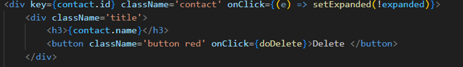
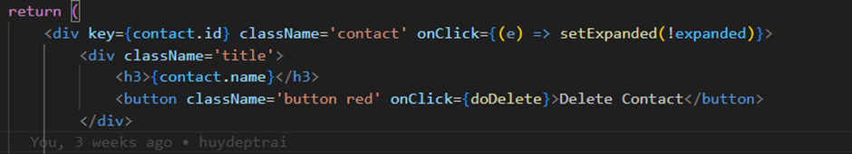
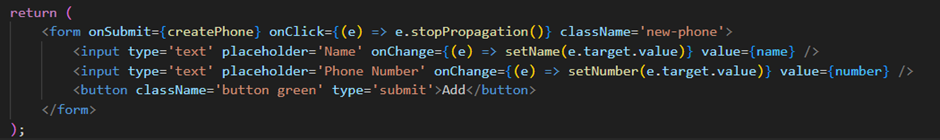
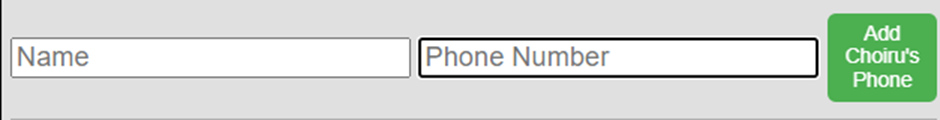
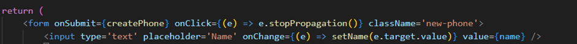
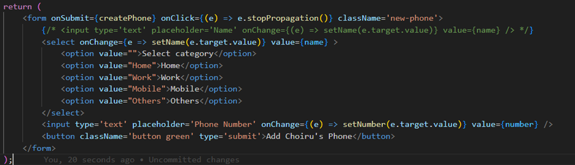
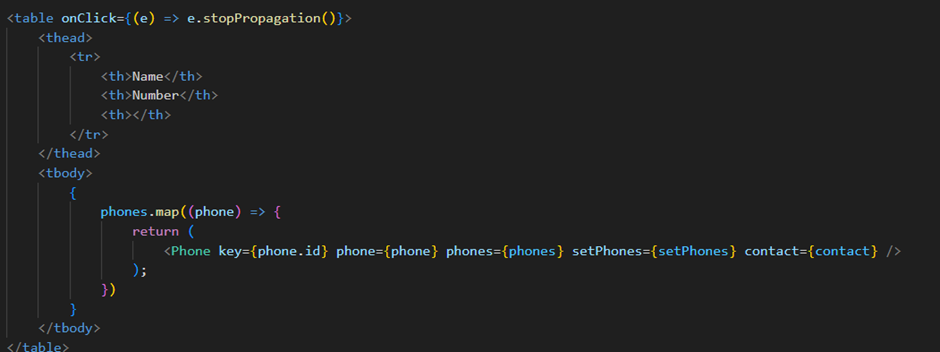
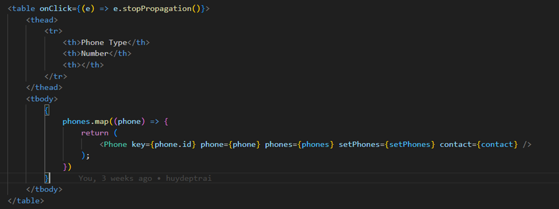

# README.md

IMPORTANT: Once you've cloned this to your forked repository, ensure that you continuously update this document as you complete each task to demonstrate your ongoing progress.

Please include your shared repository link here:

Example:
Choiru's shared repository: https://github.com/choiruzain-latrobe/Assignment2.git


Make sure for **your case it is in Private**
## Access Database
1 **Plsql Cheat Sheet:**
You can refer to the PostgreSQL cheat sheet [here](https://www.postgresqltutorial.com/postgresql-cheat-sheet/).

2 **Know the Container ID:**
To find out the container ID, execute the following command:
   ```bash
   docker ps
    9958a3a534c9   testsystem-nginx           "/docker-entrypoint.…"   6 minutes ago   Up 6 minutes   0.0.0.0:80->80/tcp   testsystem-nginx-1
    53121618baa4   testsystem-frontend        "docker-entrypoint.s…"   6 minutes ago   Up 6 minutes   3000/tcp             testsystem-frontend-1
    c89e46ac94b0   testsystem-api             "docker-entrypoint.s…"   6 minutes ago   Up 6 minutes   5000/tcp             testsystem-api-1
    9f4aea7cf538   postgres:15.3-alpine3.18   "docker-entrypoint.s…"   6 minutes ago   Up 6 minutes   5432/tcp             testsystem-db-1
   ```
3. Running the application

**docker compose command:**
   ```bash
   docker compose up --build
   ```

4 **Access postgreSQL in the container:**
Once you have the container ID, you can execute the container using the following command:
You will see the example of running the PostgreSQL inside the container.
   ```bash
   docker exec -it testsystem-db-1 psql -U postgres
   choiruzain@MacMarichoy TestSystem % docker exec -it testsystem-db-1 psql -U postgres                                       
   psql (15.3)
   Type "help" for help.
   
   postgres=# \dt
             List of relations
    Schema |   Name   | Type  |  Owner   
   --------+----------+-------+----------
    public | contacts | table | postgres
    public | phones   | table | postgres
   (2 rows)
  
    postgres=# select * from contacts;
    id |  name  |         createdAt         |         updatedAt         
   ----+--------+---------------------------+---------------------------
     1 | Helmut | 2024-08-08 11:57:57.88+00 | 2024-08-08 11:57:57.88+00
    (1 row)
    postgres=# select * from phones;
    id | phone_type |   number    | contactId |         createdAt          |         updatedAt          
   ----+------------+-------------+-----------+----------------------------+----------------------------
     1 | Work       | 081431      |         1 | 2024-08-08 11:59:04.386+00 | 2024-08-08 11:59:04.386+00


postgres=# select * from contacts;
   ```
Replace `container_ID` with the actual ID of the container you want to execute.

## Executing API


### Phone API

Task 1
1) Change the button label from contact component from "Delete" to "Delete Contact"
Change at ```contact.js``` component

Origin:<br/>

Code:<br/>


After: <br/>

Code:<br/>

2) Change the button label in phone component from "Add" to e.g "Add Choiru’s Phone" (3 Marks)
To do this task , we need to change code in ```NewPhone.js``` in components folder <br/>
Before:<br/>


After:<br/>



3) Change the placeholder text "Name" with input type text into a drop-down menu with 4 categories (3
Marks)
To do this task , we need to change code in ```NewPhone.js``` in components folder <br/>
Before: <br/>



After: <br/>



4) In the <tr> element of the table, change the label "Name" to "Phone Type" (2 Marks)
To do this task, We need to change code in ```Phonelist.js``` in components folder
Before:<br/>


After: <br/>



Task 2: API COMMAND DEMONSTRATIONS (8 MARKS)

1) Show the API command for “Show Contact” and provide a screenshot of the output (1 Mark)
```bash
Get  contact API (GET):
http get http://localhost/api/contacts
HTTP/1.1 200 OK
Access-Control-Allow-Origin: http://localhost:3000
Connection: keep-alive
Content-Length: 203
Content-Type: application/json; charset=utf-8
Date: Tue, 24 Sep 2024 02:20:51 GMT
ETag: W/"cb-Vs6d2BKKVA+jWJLRG7cPTI262CI"
Server: nginx/1.25.1
Vary: Origin
X-Powered-By: Express

[
    {
        "createdAt": "2024-09-24T02:12:44.445Z",
        "id": 1,
        "name": "Huy ",
        "updatedAt": "2024-09-24T02:12:44.445Z"
    },
    {
        "createdAt": "2024-09-24T02:17:32.654Z",
        "id": 2,
        "name": "Khoa",
        "updatedAt": "2024-09-24T02:17:32.654Z"
    }
]
```
2) Show the API command for “Add Contact” and provide a screenshot of the output (1 Mark)
```bash
Add contact API(POST):
http post http://localhost/api/contacts name="Khoa"
HTTP/1.1 200 OK
Access-Control-Allow-Origin: http://localhost:3000
Connection: keep-alive
Content-Length: 100
Content-Type: application/json; charset=utf-8
Date: Tue, 24 Sep 2024 02:17:32 GMT
ETag: W/"64-VRrKSLehFglbhMKtnSWgls7LYn8"
Server: nginx/1.25.1
Vary: Origin
X-Powered-By: Express

{
    "createdAt": "2024-09-24T02:17:32.654Z",
    "id": 2,
    "name": "Khoa",
    "updatedAt": "2024-09-24T02:17:32.654Z"
}
```
3) Show the API command for “Delete Contact” and provide a screenshot of the output (1 Marks)
```bash
Delete contact (DELETE)
http delete  http://localhost/api/contacts/2
HTTP/1.1 200 OK
Access-Control-Allow-Origin: http://localhost:3000
Connection: keep-alive
Content-Length: 47
Content-Type: application/json; charset=utf-8
Date: Tue, 24 Sep 2024 02:24:32 GMT
ETag: W/"2f-i0D5Qo4IGfH+OpTTITmyTnSzFvU"
Server: nginx/1.25.1
Vary: Origin
X-Powered-By: Express

{
    "message": "Contact was deleted successfully!"
}
```
4) Show the API command for “Update Contact” and provide a screenshot of the output (1 Marks)
```bash
Update contact (  PUT)
http put http://localhost/api/contacts/1 name="HuyTrinh"
HTTP/1.1 200 OK
Access-Control-Allow-Origin: http://localhost:3000
Connection: keep-alive
Content-Length: 47
Content-Type: application/json; charset=utf-8
Date: Tue, 24 Sep 2024 02:35:57 GMT
ETag: W/"2f-9DEigpdI8FmatdY6qgJYc7CM5hQ"
Server: nginx/1.25.1
Vary: Origin
X-Powered-By: Express

{
    "message": "Contact was updated successfully."
}
```
5) Show the API command for “Show Phone” and provide a screenshot of the output (1 Mark)
```bash
Show phone (GET)
http get http://localhost/api/contacts/3/phones
HTTP/1.1 200 OK
Access-Control-Allow-Origin: http://localhost:3000
Connection: keep-alive
Content-Length: 134
Content-Type: application/json; charset=utf-8
Date: Tue, 24 Sep 2024 03:00:21 GMT
ETag: W/"86-gsIiwLVOvUdHylIsbo6XQkIoNUs"
Server: nginx/1.25.1
Vary: Origin
X-Powered-By: Express

[
    {
        "contactId": 3,
        "createdAt": "2024-09-24T02:58:48.330Z",
        "id": 4,
        "name": "Home",
        "number": "011111",
        "updatedAt": "2024-09-24T02:58:48.330Z"
    }
]
```
6) Show the API command for “Add Phone” and provide a screenshot of the output (1 Marks)
```bash
Add phone (POST)
http post http://localhost/api/contacts/3/phones name="Home" number="011111”
HTTP/1.1 200 OK
Access-Control-Allow-Origin: http://localhost:3000
Connection: keep-alive
Content-Length: 132
Content-Type: application/json; charset=utf-8
Date: Tue, 24 Sep 2024 02:58:48 GMT
ETag: W/"84-CmKdS9bWy7s3IBY8IucRYr414/E"
Server: nginx/1.25.1
Vary: Origin
X-Powered-By: Express

{
    "contactId": 3,
    "createdAt": "2024-09-24T02:58:48.330Z",
    "id": 4,
    "name": "Home",
    "number": "011111",
    "updatedAt": "2024-09-24T02:58:48.330Z"
}
```
7) Show the API command for “Delete Phone” and provide a screenshot of the output (1 Marks)
```bash
Delete phone (DELETE)
http delete http://localhost/api/contacts/3/phones/4
HTTP/1.1 200 OK
Access-Control-Allow-Origin: http://localhost:3000
Connection: keep-alive
Content-Length: 45
Content-Type: application/json; charset=utf-8
Date: Tue, 24 Sep 2024 03:09:24 GMT
ETag: W/"2d-FdOer7L1Hk5YcQlrlpn01BrNJmA"
Server: nginx/1.25.1
Vary: Origin
X-Powered-By: Express

{
    "message": "Phone was deleted successfully!"
}
```
8) Show the API command for “Update Phone” and provide a screenshot of the output (1 Marks)
```bash
Update phone (PUT)
http put http://localhost/api/contacts/3/phones/4 name="Work"
HTTP/1.1 200 OK
Access-Control-Allow-Origin: http://localhost:3000
Connection: keep-alive
Content-Length: 45
Content-Type: application/json; charset=utf-8
Date: Tue, 24 Sep 2024 03:07:05 GMT
ETag: W/"2d-p9Lx2PQGimApZ9nkrVa0opZVZlQ"
Server: nginx/1.25.1
Vary: Origin
X-Powered-By: Express

{
    "message": "Phone was updated successfully."
}
``` 
Task 3: - DATABASE MODELLING WITH SEQUELIZE AND TEST THE API COMMANDS WHEN THE
DATABASE MODIFICATION DONE (22 MARKS)

1) Modify the contacts Table (5 Marks):
``` bash
a. Update the contacts table to include the following attributes:
i. id
ii. Name
iii. Address
```
Code :  Change at contact.model.js file in models folder:

Result in database:

2) Modify the phones Table (5 Marks):
```bash
a. Update the phones table to include the following attributes:
i. id
ii. phone_type
iii. phone_number
iv. contactId
```
Change code in phone.model.js file in models folder

Result in database:


3) Adjust the Front-End (4 Marks):
To change contact frontend, first we need to change create method in contact.controller.js  file to help us create a new phone with address attribute 

After that we change code  in contact.js and NewContact.js in components folder to get the suitable frontend:


Result:

We do the same with Phone.Change code in create phone method in phone.controller.js 

Change at phone.js, PhoneList,js and NewPhone.js component to get the suitable frontend:


Result:

4) Test All APIs related to table modified contacts and phones (8 Marks):
Contact API
### Add contact API (POST) 
``` bash
http post http://localhost/api/contacts name="Khoa" address=”Ha Noi”
HTTP/1.1 200 OK
Access-Control-Allow-Origin: http://localhost:3000
Connection: keep-alive
Content-Length: 119
Content-Type: application/json; charset=utf-8
Date: Tue, 24 Sep 2024 11:46:17 GMT
ETag: W/"77-ujajulYXCHdYPgQudiQ35JWsSbY"
Server: nginx/1.25.1
Vary: Origin
X-Powered-By: Express

{
    "address": "Ha Noi",
    "createdAt": "2024-09-24T11:46:17.888Z",
    "id": 3,
    "name": "Khoa",
    "updatedAt": "2024-09-24T11:46:17.888Z"
}

```
### Get contact API (GET)
``` bash
http get http://localhost/api/contacts
HTTP/1.1 200 OK
Access-Control-Allow-Origin: http://localhost:3000
Connection: keep-alive
Content-Length: 242
Content-Type: application/json; charset=utf-8
Date: Tue, 24 Sep 2024 11:47:08 GMT
ETag: W/"f2-yOps9jdrFqdZEQOjTNiEv7RQsKE"
Server: nginx/1.25.1
Vary: Origin
X-Powered-By: Express

[
    {
        "address": "Viet Nam",
        "createdAt": "2024-09-24T07:02:43.679Z",
        "id": 1,
        "name": "huy",
        "updatedAt": "2024-09-24T07:02:43.679Z"
    },
    {
        "address": "Ha Noi",
        "createdAt": "2024-09-24T11:46:17.888Z",
        "id": 3,
        "name": "Khoa",
        "updatedAt": "2024-09-24T11:46:17.888Z"
    }
]
```
### Delete contact (DELETE)
``` bash
http delete  http://localhost/api/contacts/3
HTTP/1.1 200 OK
Access-Control-Allow-Origin: http://localhost:3000
Connection: keep-alive
Content-Length: 47
Content-Type: application/json; charset=utf-8
Date: Tue, 24 Sep 2024 11:47:59 GMT
ETag: W/"2f-i0D5Qo4IGfH+OpTTITmyTnSzFvU"
Server: nginx/1.25.1
Vary: Origin
X-Powered-By: Express

{
    "message": "Contact was deleted successfully!"
}
``` 
### Update contact  (PUT)
``` bash
http put http://localhost/api/contacts/1 name=”Huy Van”  address =”Nam Dinh”
HTTP/1.1 200 OK
Access-Control-Allow-Origin: http://localhost:3000
Connection: keep-alive
Content-Length: 47
Content-Type: application/json; charset=utf-8
Date: Tue, 24 Sep 2024 11:54:06 GMT
ETag: W/"2f-9DEigpdI8FmatdY6qgJYc7CM5hQ"
Server: nginx/1.25.1
Vary: Origin
X-Powered-By: Express

{
    "message": "Contact was updated successfully."
}
```
### Add phone API (POST)
``` bash
http post http://localhost/api/contacts/1/phones phone_type="Home" phone_number=” 01234567”
HTTP/1.1 200 OK
Access-Control-Allow-Origin: http://localhost:3000
Connection: keep-alive
Content-Length: 146
Content-Type: application/json; charset=utf-8
Date: Tue, 24 Sep 2024 11:55:48 GMT
ETag: W/"92-PL7Fk5b/YUOsLjjOiafGHiP97Qo"
Server: nginx/1.25.1
Vary: Origin
X-Powered-By: Express

{
    "contactId": 1,
    "createdAt": "2024-09-24T11:55:48.671Z",
    "id": 2,
    "phone_number": "01234567",
    "phone_type": "Home",
    "updatedAt": "2024-09-24T11:55:48.671Z"
}
```
### Show Phone API (GET)
``` bash
http get http://localhost/api/contacts/1/phones
 HTTP/1.1 200 OK
Access-Control-Allow-Origin: http://localhost:3000
Connection: keep-alive
Content-Length: 294
Content-Type: application/json; charset=utf-8
Date: Tue, 24 Sep 2024 11:58:43 GMT
ETag: W/"126-hy86kFdL2gdWmkk5uWMi22PZroQ"
Server: nginx/1.25.1
Vary: Origin
X-Powered-By: Express

[
    {
        "contactId": 1,
        "createdAt": "2024-09-24T07:02:48.888Z",
        "id": 1,
        "phone_number": "1234567",
        "phone_type": "Work",
        "updatedAt": "2024-09-24T07:02:48.888Z"
    },
    {
        "contactId": 1,
        "createdAt": "2024-09-24T11:55:48.671Z",
        "id": 2,
        "phone_number": "01234567",
        "phone_type": "Home",
        "updatedAt": "2024-09-24T11:55:48.671Z"
    }
]
```
### Update phone (PUT)
``` bash
http put http://localhost/api/contacts/1/phones/2 phone_type="Work" phone_number=” 11111111”
HTTP/1.1 200 OK
Access-Control-Allow-Origin: http://localhost:3000
Connection: keep-alive
Content-Length: 45
Content-Type: application/json; charset=utf-8
Date: Tue, 24 Sep 2024 12:02:24 GMT
ETag: W/"2d-p9Lx2PQGimApZ9nkrVa0opZVZlQ"
Server: nginx/1.25.1
Vary: Origin
X-Powered-By: Express

{
    "message": "Phone was updated successfully."
}
```
### Delete Phone (DELETE)
``` bash
http delete http://localhost/api/contacts/1/phones/2
HTTP/1.1 200 OK
Access-Control-Allow-Origin: http://localhost:3000
Connection: keep-alive
Content-Length: 45
Content-Type: application/json; charset=utf-8
Date: Tue, 24 Sep 2024 12:03:39 GMT
ETag: W/"2d-FdOer7L1Hk5YcQlrlpn01BrNJmA"
Server: nginx/1.25.1
Vary: Origin
X-Powered-By: Express

{
    "message": "Phone was deleted successfully!"
}
```

TASK 4 - EXPANDING THE EXISTING TABLES (E.G. COMPANY) - 30 MARKS
1) Table creation  
To create a table name "companies" , I will create a file named "company.model.js" in models folder

After saving , this is the result in the database:

2) API Creation
So , to creating new API, I defined routes in a file called "companies.routes.js" in routes folder

And to define method in each route, I make a new file named company.controller.js in controller folder

And to make all of these things worked, I have to define them in app,js file 

And now this is API test result:
### ADD COMPANY API (POST)
```bash
http post http://localhost/api/contacts/1/companies company_name="VietTel" company_address="HaNoi"
HTTP/1.1 200 OK
Access-Control-Allow-Origin: http://localhost:3000
Connection: keep-alive
Content-Length: 160
Content-Type: application/json; charset=utf-8
Date: Sun, 06 Oct 2024 21:35:33 GMT
ETag: W/"a0-bn5wp9L2U5oRAjK7yn8Kd0XxTd4"
Server: nginx/1.25.1
Vary: Origin
X-Powered-By: Express

{
    "company_address": "HaNoi",
    "company_id": 1,
    "company_name": "VietTel",
    "contact_id": 1,
    "createdAt": "2024-10-06T21:35:32.980Z",
    "updatedAt": "2024-10-06T21:35:32.980Z"
}
```
### SHOW COMPANY API (GET)
```bash
http get http://localhost/api/contacts/1/companies
HTTP/1.1 200 OK
Access-Control-Allow-Origin: http://localhost:3000
Connection: keep-alive
Content-Length: 162
Content-Type: application/json; charset=utf-8
Date: Sun, 06 Oct 2024 21:37:32 GMT
ETag: W/"a2-Bs7jeohLrNjjvKHlCOo4PsNb45g"
Server: nginx/1.25.1
Vary: Origin
X-Powered-By: Express

[
    {
        "company_address": "HaNoi",
        "company_id": 1,
        "company_name": "VietTel",
        "contact_id": 1,
        "createdAt": "2024-10-06T21:35:32.980Z",
        "updatedAt": "2024-10-06T21:35:32.980Z"
    }
]
```
### UPDATE COMPANY (PUT)
```bash
http put http://localhost/api/contacts/1/companies/1 company_name="Amazon" company_address="Melbourne"
HTTP/1.1 200 OK
Access-Control-Allow-Origin: http://localhost:3000
Connection: keep-alive
Content-Length: 163
Content-Type: application/json; charset=utf-8
Date: Sun, 06 Oct 2024 21:41:07 GMT
ETag: W/"a3-rfOPA2VY5tWyggO5nztmZWRngTs"
Server: nginx/1.25.1
Vary: Origin
X-Powered-By: Express

{
    "company_address": "Melbourne",
    "company_id": 1,
    "company_name": "Amazon",
    "contact_id": 1,
    "createdAt": "2024-10-06T21:35:32.980Z",
    "updatedAt": "2024-10-06T21:41:07.538Z"
}
```
### DELETE COMPANY (DELETE)
```bash
http delete http://localhost/api/contacts/1/companies/1
HTTP/1.1 200 OK
Access-Control-Allow-Origin: http://localhost:3000
Connection: keep-alive
Content-Length: 47
Content-Type: application/json; charset=utf-8
Date: Sun, 06 Oct 2024 21:44:41 GMT
ETag: W/"2f-goeWLYgQgcZh1o2QS0V4ovFdEa0"
Server: nginx/1.25.1
Vary: Origin
X-Powered-By: Express

{
    "message": "Company was deleted successfully!"
}
```
TASK 5 - FRONT END
So in this task, I create 3 new file in the components folder. The first one is Newcompany.js<br/>
This file will help me to create a new company using the CREATE method <br/>

