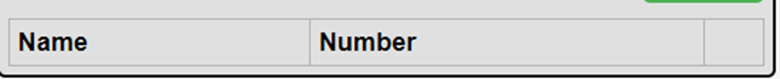

# README.md

IMPORTANT: Once you've cloned this to your forked repository, ensure that you continuously update this document as you complete each task to demonstrate your ongoing progress.

Please include your shared repository link here:

Example:
Choiru's shared repository: https://github.com/choiruzain-latrobe/Assignment2.git


Make sure for **your case it is in Private**
## Access Database
1 **Plsql Cheat Sheet:**
You can refer to the PostgreSQL cheat sheet [here](https://www.postgresqltutorial.com/postgresql-cheat-sheet/).

2 **Know the Container ID:**
To find out the container ID, execute the following command:
   ```bash
   docker ps
    9958a3a534c9   testsystem-nginx           "/docker-entrypoint.…"   6 minutes ago   Up 6 minutes   0.0.0.0:80->80/tcp   testsystem-nginx-1
    53121618baa4   testsystem-frontend        "docker-entrypoint.s…"   6 minutes ago   Up 6 minutes   3000/tcp             testsystem-frontend-1
    c89e46ac94b0   testsystem-api             "docker-entrypoint.s…"   6 minutes ago   Up 6 minutes   5000/tcp             testsystem-api-1
    9f4aea7cf538   postgres:15.3-alpine3.18   "docker-entrypoint.s…"   6 minutes ago   Up 6 minutes   5432/tcp             testsystem-db-1
   ```
3. Running the application

**docker compose command:**
   ```bash
   docker compose up --build
   ```

4 **Access postgreSQL in the container:**
Once you have the container ID, you can execute the container using the following command:
You will see the example of running the PostgreSQL inside the container.
   ```bash
   docker exec -it testsystem-db-1 psql -U postgres
   choiruzain@MacMarichoy TestSystem % docker exec -it testsystem-db-1 psql -U postgres                                       
   psql (15.3)
   Type "help" for help.
   
   postgres=# \dt
             List of relations
    Schema |   Name   | Type  |  Owner   
   --------+----------+-------+----------
    public | contacts | table | postgres
    public | phones   | table | postgres
   (2 rows)
  
    postgres=# select * from contacts;
    id |  name  |         createdAt         |         updatedAt         
   ----+--------+---------------------------+---------------------------
     1 | Helmut | 2024-08-08 11:57:57.88+00 | 2024-08-08 11:57:57.88+00
    (1 row)
    postgres=# select * from phones;
    id | phone_type |   number    | contactId |         createdAt          |         updatedAt          
   ----+------------+-------------+-----------+----------------------------+----------------------------
     1 | Work       | 081431      |         1 | 2024-08-08 11:59:04.386+00 | 2024-08-08 11:59:04.386+00


postgres=# select * from contacts;
   ```
Replace `container_ID` with the actual ID of the container you want to execute.

## Executing API

### Contact API


1. Add contacts API  (POST)
```bash
http post http://localhost/api/contacts name="Choiru"
        
choiruzain@MacMarichoy-7 TestSystem % http post http://localhost/api/contacts name="Choiru"
HTTP/1.1 200 OK
Access-Control-Allow-Origin: http://localhost:3000
Connection: keep-alive
Content-Length: 102
Content-Type: application/json; charset=utf-8
Date: Thu, 08 Aug 2024 21:01:53 GMT
ETag: W/"66-FmPYAaIkyQoroDwP2JsAZjWTAxs"
Server: nginx/1.25.1
Vary: Origin
X-Powered-By: Express

{
"createdAt": "2024-08-08T21:01:53.017Z",
"id": 1,
"name": "Choiru",
"updatedAt": "2024-08-08T21:01:53.017Z"
}

```
2 Get contacts API  (GET)

```bash
http get http://localhost/api/contacts


choiruzain@MacMarichoy-7 TestSystem % http get http://localhost/api/contacts
HTTP/1.1 200 OK
Access-Control-Allow-Origin: http://localhost:3000
Connection: keep-alive
Content-Length: 104
Content-Type: application/json; charset=utf-8
Date: Thu, 08 Aug 2024 21:04:58 GMT
ETag: W/"68-V+4KuL2xahYt8YAkKG6rKdR7wHg"
Server: nginx/1.25.1
Vary: Origin
X-Powered-By: Express

[
{
"createdAt": "2024-08-08T21:01:53.017Z",
"id": 1,
"name": "Choiru",
"updatedAt": "2024-08-08T21:01:53.017Z"
}
]


```
3. Show/create the API commmand to delete the contacts (DELETE)

```bash


```

4. Show/create the API command to edit the contacts (PUT)
```
http get http://localhost/api/contacts/1/phones

```

### Phone API

Task 1
1) Change the button label from contact component from "Delete" to "Delete Contact"
Change at contact.js component

Origin: 

Code:


After: 

Code:

2) Change the button label in phone component from "Add" to e.g "Add Choiru’s Phone" (3 Marks)
Before:


After:


3) Change the placeholder text "Name" with input type text into a drop-down menu with 4 categories (3
Marks)
Before:


After:


4) In the <tr> element of the table, change the label "Name" to "Phone Type" (2 Marks)

Before:


After:


Task 2: API COMMAND DEMONSTRATIONS (8 MARKS)

1) Show the API command for “Show Contact” and provide a screenshot of the output (1 Mark)
Get  contact API (GET):
http get http://localhost/api/contacts
HTTP/1.1 200 OK
Access-Control-Allow-Origin: http://localhost:3000
Connection: keep-alive
Content-Length: 203
Content-Type: application/json; charset=utf-8
Date: Tue, 24 Sep 2024 02:20:51 GMT
ETag: W/"cb-Vs6d2BKKVA+jWJLRG7cPTI262CI"
Server: nginx/1.25.1
Vary: Origin
X-Powered-By: Express

[
    {
        "createdAt": "2024-09-24T02:12:44.445Z",
        "id": 1,
        "name": "Huy ",
        "updatedAt": "2024-09-24T02:12:44.445Z"
    },
    {
        "createdAt": "2024-09-24T02:17:32.654Z",
        "id": 2,
        "name": "Khoa",
        "updatedAt": "2024-09-24T02:17:32.654Z"
    }
]
2) Show the API command for “Add Contact” and provide a screenshot of the output (1 Mark)
Add contact API(POST):
http post http://localhost/api/contacts name="Khoa"
HTTP/1.1 200 OK
Access-Control-Allow-Origin: http://localhost:3000
Connection: keep-alive
Content-Length: 100
Content-Type: application/json; charset=utf-8
Date: Tue, 24 Sep 2024 02:17:32 GMT
ETag: W/"64-VRrKSLehFglbhMKtnSWgls7LYn8"
Server: nginx/1.25.1
Vary: Origin
X-Powered-By: Express

{
    "createdAt": "2024-09-24T02:17:32.654Z",
    "id": 2,
    "name": "Khoa",
    "updatedAt": "2024-09-24T02:17:32.654Z"
}
3) Show the API command for “Delete Contact” and provide a screenshot of the output (1 Marks)
Delete contact (DELETE)
http delete  http://localhost/api/contacts/2
HTTP/1.1 200 OK
Access-Control-Allow-Origin: http://localhost:3000
Connection: keep-alive
Content-Length: 47
Content-Type: application/json; charset=utf-8
Date: Tue, 24 Sep 2024 02:24:32 GMT
ETag: W/"2f-i0D5Qo4IGfH+OpTTITmyTnSzFvU"
Server: nginx/1.25.1
Vary: Origin
X-Powered-By: Express

{
    "message": "Contact was deleted successfully!"
}
4) Show the API command for “Update Contact” and provide a screenshot of the output (1 Marks)
Update contact (  PUT)
http put http://localhost/api/contacts/1 name="HuyTrinh"
HTTP/1.1 200 OK
Access-Control-Allow-Origin: http://localhost:3000
Connection: keep-alive
Content-Length: 47
Content-Type: application/json; charset=utf-8
Date: Tue, 24 Sep 2024 02:35:57 GMT
ETag: W/"2f-9DEigpdI8FmatdY6qgJYc7CM5hQ"
Server: nginx/1.25.1
Vary: Origin
X-Powered-By: Express

{
    "message": "Contact was updated successfully."
}

5) Show the API command for “Show Phone” and provide a screenshot of the output (1 Mark)
Show phone (GET)
http get http://localhost/api/contacts/3/phones
HTTP/1.1 200 OK
Access-Control-Allow-Origin: http://localhost:3000
Connection: keep-alive
Content-Length: 134
Content-Type: application/json; charset=utf-8
Date: Tue, 24 Sep 2024 03:00:21 GMT
ETag: W/"86-gsIiwLVOvUdHylIsbo6XQkIoNUs"
Server: nginx/1.25.1
Vary: Origin
X-Powered-By: Express

[
    {
        "contactId": 3,
        "createdAt": "2024-09-24T02:58:48.330Z",
        "id": 4,
        "name": "Home",
        "number": "011111",
        "updatedAt": "2024-09-24T02:58:48.330Z"
    }
]
6) Show the API command for “Add Phone” and provide a screenshot of the output (1 Marks)
Add phone (POST)
http post http://localhost/api/contacts/3/phones name="Home" number="011111”
HTTP/1.1 200 OK
Access-Control-Allow-Origin: http://localhost:3000
Connection: keep-alive
Content-Length: 132
Content-Type: application/json; charset=utf-8
Date: Tue, 24 Sep 2024 02:58:48 GMT
ETag: W/"84-CmKdS9bWy7s3IBY8IucRYr414/E"
Server: nginx/1.25.1
Vary: Origin
X-Powered-By: Express

{
    "contactId": 3,
    "createdAt": "2024-09-24T02:58:48.330Z",
    "id": 4,
    "name": "Home",
    "number": "011111",
    "updatedAt": "2024-09-24T02:58:48.330Z"
}
7) Show the API command for “Delete Phone” and provide a screenshot of the output (1 Marks)
Delete phone (DELETE)
http delete http://localhost/api/contacts/3/phones/4
HTTP/1.1 200 OK
Access-Control-Allow-Origin: http://localhost:3000
Connection: keep-alive
Content-Length: 45
Content-Type: application/json; charset=utf-8
Date: Tue, 24 Sep 2024 03:09:24 GMT
ETag: W/"2d-FdOer7L1Hk5YcQlrlpn01BrNJmA"
Server: nginx/1.25.1
Vary: Origin
X-Powered-By: Express

{
    "message": "Phone was deleted successfully!"
}
8) Show the API command for “Update Phone” and provide a screenshot of the output (1 Marks)
Update phone (PUT)
http put http://localhost/api/contacts/3/phones/4 name="Work"
HTTP/1.1 200 OK
Access-Control-Allow-Origin: http://localhost:3000
Connection: keep-alive
Content-Length: 45
Content-Type: application/json; charset=utf-8
Date: Tue, 24 Sep 2024 03:07:05 GMT
ETag: W/"2d-p9Lx2PQGimApZ9nkrVa0opZVZlQ"
Server: nginx/1.25.1
Vary: Origin
X-Powered-By: Express

{
    "message": "Phone was updated successfully."
}

